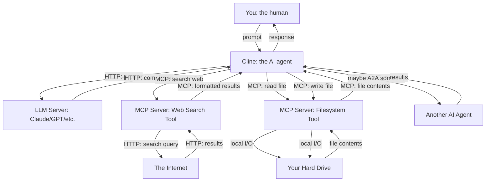

# AI Alphabet Soup

## Making Sense of the Acronyms, Jargon, and Why Everything Is Just HTTP Servers Talking to Each Other

**Purpose:** The AI tool ecosystem is drowning in acronyms — MCP, ACP, A2A, LLM, API, RDF, and a hundred more. Many of these describe genuinely new ideas. Many of them are old ideas wearing new clothes because AI people love naming things. This document cuts through the noise. By the end, you will understand what these acronyms actually *are*, what they actually *do*, and why almost everything in AI tooling is just an HTTP server with a very specific job.

---

### The Core Insight: Everything Is an HTTP Server

Before we decode any acronyms, hold this one idea in your head:

> **Almost every AI system you will encounter — agents, tools, protocols, platforms — is, at its physical level, a collection of HTTP servers talking to each other over the internet. What makes them new and different is not *how* they communicate (HTTP has been doing that since the 1990s), but *what* is loaded on those servers and *what they can say to each other*.**

Think of the internet. Your browser (an HTTP client) talks to a web server (an HTTP server). The server sends back HTML, CSS, and JavaScript. That has been the pattern for thirty years.

Now think of an AI system. Cline (an AI agent) talks to Claude (an AI model running on an HTTP server). Cline also talks to an MCP server (another HTTP server that exposes tools). The MCP server might talk to your filesystem, a database, or the web. Cline might talk to another agent via ACP or A2A (still HTTP servers, just with different message formats). Your browser displays the results.

**Same pipes. Different cargo.** The innovation is not in the transport layer — it is in the data models, the protocols for *what* gets sent, and the intelligence of the software running on those servers. Once you understand this, the acronym soup becomes manageable. Every acronym is just a label for "what kind of HTTP server is this, and what does it send and receive?"

---

### The Acronym Decoder

#### LLM — Large Language Model

**What it actually is:** Software running on a server (or cluster of servers) that takes text as input and predicts what text should come next, one token at a time. That is it. The magic is that, trained on enormous datasets, this "predict the next word" capability produces outputs that look like reasoning, creativity, and knowledge.

**What it is not:** A database. A search engine. A person. A source of truth. A reasoning engine in the human sense. It is a pattern-completion machine. The patterns happen to be very useful.

**Plain English:** When you type a prompt into Cline, Cline sends your text over HTTP to an LLM server. The server runs the model, generates a response token by token, and streams it back. The model does not "know" anything — it predicts what tokens are most probable given your prompt and its training.

**Related terms people use to sound smart:** "transformer architecture," "attention mechanism," "autoregressive generation," "neural network." These are real things, but you do not need to understand them to use the tools effectively. Understanding that the LLM is a pattern-completer, not a knower, is the essential insight.

---

#### API — Application Programming Interface

**What it actually is:** A set of rules for how one program talks to another. Usually this means: "send an HTTP request to this URL with this format, and you will get back a response in that format." That is it. APIs have existed for decades. REST APIs, GraphQL APIs, gRPC APIs — all variations on the same theme.

**Why AI people talk about it constantly:** Because everything in AI is an API. The LLM has an API. The MCP server has an API. The agent has an API. When people say "the Claude API," they mean "the HTTP endpoint where you send prompts and receive completions." When people say "the OpenAI API," they mean the same thing for GPT models.

**Plain English:** An API is a menu. The menu tells you what you can order (the endpoints), what information you need to provide (the parameters), and what you will get back (the response). Everything else is implementation details.

---

#### MCP — Model Context Protocol

**What it actually is:** An HTTP server — plus a specification for what messages it sends and receives — designed to expose *tools* that an AI agent can use. A "tool" might be reading a file, searching the web, querying a database, or running a terminal command. The MCP server sits between the AI agent and the thing the agent wants to do, translating the agent's requests into actions and the results back into text the agent can understand.

**The old idea it is built on:** HTTP APIs with a standardized message format. MCP did not invent "program talks to another program over HTTP." It standardized *how* AI agents talk to tools, so any agent can use any MCP-compatible tool without custom integration.

**Plain English:** Think of MCP as a universal power adapter. Before MCP, if you wanted your AI agent to read a file, search the web, and query a database, you needed three different adapters with three different plug shapes. MCP says: "all tools will use this one plug shape." The MCP server is the adapter. The tool is the appliance. The AI agent is the person plugging things in.

**The acronym stripped bare:**

| Fancy Term | What It Means |
|-------------|---------------|
| Model | The AI model (LLM) that wants to use tools |
| Context | The information the model needs to use the tool correctly |
| Protocol | The rules for how messages are formatted and exchanged |

**When you encounter it:** Cline uses MCP servers to read your files, run terminal commands, and search the web. When you ask Cline "read my CSV file and summarize it," Cline sends an MCP message to a filesystem MCP server, which reads the file and returns the contents.

---

#### ACP — Agent Client Protocol

**What it actually is:** A protocol that standardizes communication between code editors/IDEs and coding agents — similar to how LSP standardized language server integration. If MCP is "here is a hammer you can use," ACP is "here is a standardized way for your editor to talk to the carpenter." ACP is part of the A2A (Agent-to-Agent) protocol ecosystem. ([Official site](https://agentclientprotocol.com/get-started/introduction))

**The old idea it is built on:** The Language Server Protocol (LSP). Just as LSP decoupled language support from specific editors, ACP decouples coding agents from specific editors. Before ACP, every agent-editor combination required custom integration work. ACP defines a common protocol so that any ACP-compatible agent works with any ACP-compatible editor.

**Plain English:** MCP lets an AI agent use a tool. A2A lets agents talk to each other. ACP — as part of A2A — standardizes the specific conversation between an editor/IDE and a coding agent. An editor that supports ACP can work with any ACP-compatible agent (local or remote), and an agent that implements ACP works with any ACP-compatible editor.

**The acronym stripped bare:**

| Fancy Term | What It Means |
|-------------|---------------|
| Agent | A coding agent (like Cline, Zed Agent) that can take actions in your codebase |
| Client | The code editor/IDE that wants to use the agent |
| Protocol | The rules for how the editor and agent talk to each other |

---

#### A2A — Agent-to-Agent (Google's protocol)

**What it actually is:** Google's protocol for agent interoperability — how agents discover each other, negotiate capabilities, and collaborate on tasks without human intermediation at every step. ACP (Agent Client Protocol) is part of the A2A ecosystem, specifically handling the editor ↔ agent communication layer.

**How ACP fits into A2A:** A2A is the broader protocol for agent-to-agent communication. ACP is the component of A2A that standardizes how a code editor/IDE (the client) talks to a coding agent. Think of A2A as the full networking stack and ACP as the application layer that sits between your editor and the agent.

**Does this matter to you right now?** Not much for day-to-day work, but conceptually it helps to know the stack. As you use Cline, KiloCode, and Zed Agent together, you are implicitly doing agent orchestration — even if you are not using ACP or A2A directly. You are the human orchestrator routing tasks between agents. A2A (with ACP as its client-facing component) is an attempt to standardize and automate the orchestrator role.

---

#### MCP vs. ACP vs. A2A — The One-Minute Cheat Sheet

| | MCP | ACP | A2A |
|---|-----|-----|-----|
| **What it connects** | Agent → Tools | Editor → Agent | Agent → Agent |
| **Analogy** | A hammer | A work order form | A team meeting |
| **Who made it** | Anthropic | Community (part of A2A) | Google |
| **Status (mid-2026)** | Widely adopted | Emerging | Emerging |
| **What the server IS** | HTTP server with tool endpoints | Agent process (local/remote) | HTTP server with agent endpoints |
| **What you do with it** | "Read this file" | "Run this agent in my editor" | "Research this topic and report back" |
| **Granularity** | Single action | Agent session | Multi-step task |

---

### The AI System as a Cluster of HTTP Servers

Once you understand that MCP, ACP, A2A, and LLM APIs are all just HTTP servers with different jobs, the architecture of an AI system becomes clear. Here is what happens when you ask Cline to "research Swiss fermentation regulations and create a CSV of regulatory bodies":



Every arrow is HTTP (or local I/O). Every box on the right side is a server (or your local machine). The system is not magic — it is a network of specialized HTTP servers orchestrated by an AI agent, with you as the conductor.

---

### The Pattern Behind Every AI Acronym

Most AI acronyms follow this structure:

```
[What] + [How] + [Protocol/Model/Architecture/Standard]
```

| Acronym | What | How | The Rest |
|---------|------|-----|----------|
| LLM | Language | Large | Model |
| MCP | Model | Context | Protocol |
| ACP | Agent | Client | Protocol |
| A2A | Agent | to Agent | (implicit protocol) |
| RDF | Resource | Description | Framework |
| API | Application | Programming | Interface |
| SDK | Software | Development | Kit |
| CLI | Command | Line | Interface |

Once you see this pattern, new acronyms become easier to decode. Is it a protocol (rules for communication)? A model (software that does a specific thing)? An interface (how humans or programs interact with something)? A framework (a set of tools and conventions)? Most AI jargon fits into one of these buckets.

---

### Words That Obfuscate vs. Words That Enable

A lot of AI terminology is genuinely new and necessary — you cannot talk about "token prediction" without the word "token." But a lot of it is old ideas renamed, either because the renamers did not know the old name or because new names attract attention and funding.

**Genuinely new ideas (you need these words):**

| Term | Why It Is New |
|------|---------------|
| Hallucination | A failure mode specific to probabilistic language models — no pre-LLM system had this problem in the same way |
| Prompt engineering | Designing inputs for non-deterministic systems is fundamentally different from programming deterministic ones |
| Context window | The finite attention span of an LLM — a constraint that shapes everything about how you use it |
| Token | The atomic unit of LLM text processing — no equivalent in pre-LLM computing |
| Agent skill | A reusable prompt+tool configuration — new enough that the term is still being defined |

**Old ideas with new names (the old name works fine):**

| AI Term | Old Name | What It Actually Is |
|---------|----------|---------------------|
| MCP Server | API Server / Microservice | An HTTP server with a standardized message format for tool use |
| ACP/A2A Server | Service / Microservice | A2A: an HTTP server that exposes an agent; ACP: a standardized interface for editor-agent communication |
| Agent orchestration | Workflow automation / Service orchestration | Coordinating multiple services to complete a task |
| Tool use / Function calling | API call / RPC | One program asking another program to do something |
| Embedding | Vector / Feature vector | A list of numbers representing something (a word, a sentence, an image) in a high-dimensional space |
| RAG (Retrieval-Augmented Generation) | Search + Summarize | Look up relevant documents, feed them to the LLM, have it generate an answer based on them |
| Fine-tuning | Transfer learning / Domain adaptation | Training an existing model a little more on specific data |
| Grounding | Fact-checking / Source attribution | Making sure the model's output is tied to real, verifiable information |

**Why this matters:** When you encounter a new AI acronym, ask yourself: *is this a new idea that needs a new word, or is this an old idea being sold as new?* The answer tells you whether you need to learn a new concept or just map the new word to something you already understand.

---

### A Practical Guide to Navigating AI Jargon

**When you encounter an acronym you do not know:**

1. **Ask the AI to explain it in plain English.** "Explain MCP to me like I know what HTTP and APIs are but nothing about AI tooling."
2. **Ask what old idea it is built on.** "What pre-AI concept is ACP most similar to?"
3. **Ask what it actually IS, physically.** "Is an MCP server just an HTTP server? What does it actually run on?"
4. **Ask if the term is controversial or contested.** "Do people disagree about what ACP means? Are there competing definitions?"

**Red flags that someone is using jargon to obfuscate rather than enable:**

- They use five acronyms in one sentence
- They cannot explain the concept without using the acronym
- They cannot map the concept to something you already understand
- They get defensive when you ask for a plain-English explanation
- The explanation circles back to the same jargon ("MCP enables model-context-protocol-based tool integration")

**Green flags — someone who actually understands what they are talking about:**

- They can explain it in one sentence without jargon
- They can tell you what old idea it is built on
- They can tell you what it physically IS (a server, a file format, a message specification)
- They acknowledge when a term is overhyped or poorly named

---

### The Bottom Line

The AI tool ecosystem in mid-2026 is an alphabet soup of acronyms — LLM, MCP, ACP, A2A, API, RDF, and a hundred more. Most of them describe HTTP servers with specific jobs. What is new is not the transport layer but the intelligence running on those servers and the protocols for what they can say to each other.

When you feel overwhelmed by the jargon, remember:

1. **Almost everything is HTTP servers talking to each other.** The internet has been doing this for 30 years.
2. **Every acronym is just a label for "what kind of server is this, and what format are its messages."**
3. **Ask the AI to explain jargon in plain English.** It is very good at this.
4. **Some terms are genuinely new and necessary.** Some are old ideas with new names. Learning to tell the difference is part of AI literacy.
5. **You do not need to understand the internals of MCP or ACP to use tools that depend on them.** You need to understand what they *do*, not how they *work*.

And if all else fails: it is just HTTP servers. It has always been HTTP servers. The magic is in what is loaded on them.
