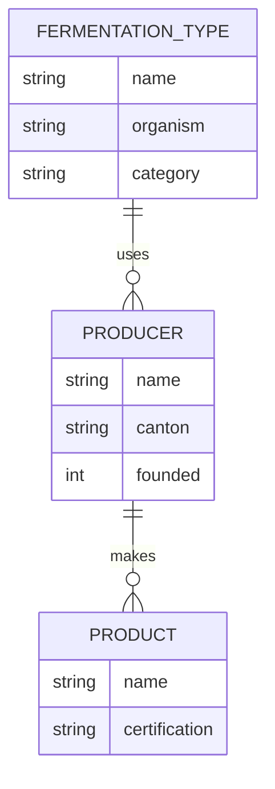

# AI & Research Literacy Dictionary

**Purpose:** A reference for the eight AI literacy competency areas. Each entry includes a definition, why it matters to your internship, and links for deeper learning at multiple levels.

**How to use this dictionary:** Do not read it cover to cover on Day 1. Skim it. Notice what you recognize and what you do not. Then return to it as you encounter concepts in practice — when Cline hallucinates, read the "Hallucination" entry. When two tools disagree, read "Probabilistic Computing." Some entries will not fully click until Week 3 or later. That is expected and fine. This document grows in value the more you use the tools.

**Link tiers:** Each topic includes links marked 🟢 (beginner — start here), 🟡 (intermediate — go deeper), and 🔴 (advanced — for the curious).

---

## 1. Git & GitHub Basics

### Version Control
**Definition:** A system that records changes to files over time, allowing you to recall specific versions, collaborate without conflict, and revert mistakes.

**Why it matters:** Your entire internship artifact collection lives in Git. Every commit is a checkpoint. If you break something, you can always go back. If the research team wants to see how your thinking evolved, the commit history tells the story.

**Key sub-concepts:** repository, commit, branch, merge, push, pull, pull request, `.gitignore`, diff, merge conflict, rebase.

**Resources:**
- 🟢 [GitHub Skills](https://skills.github.com/) — Free interactive courses from GitHub
- 🟢 [Oh My Git!](https://ohmygit.org/) — A visual game that teaches Git internals
- 🟡 [Atlassian Git Tutorials](https://www.atlassian.com/git/tutorials) — Comprehensive written guides
- 🔴 [Git Book](https://git-scm.com/book/en/v2) — The definitive reference (free online)

### Distributed Version Control
**Definition:** Every copy of a Git repository is a full backup. There is no central server that can fail and lose everything. GitHub is a convenience, not a necessity.

**Why it matters:** Your work is never trapped on one machine. Push to GitHub and you can work from anywhere. GitHub goes down? Your local copy still has everything.

---

## 2. LLM Prompting

### Prompt Engineering
**Definition:** The practice of designing inputs to large language models to produce desired outputs. Includes role assignment, constraint specification, format demands, chain-of-thought prompting, and few-shot examples.

**Why it matters:** The quality of your research output is directly proportional to the quality of your prompts. A vague prompt produces vague research. A well-structured prompt produces structured, verifiable, actionable research. This is the single most important hands-on skill you will develop.

**Key patterns:** role + task + format, chain-of-thought, verify-and-correct, source anchoring, constraint framing, few-shot learning, iterative refinement.

**Resources:**
- 🟢 [Anthropic Prompt Engineering Guide](https://docs.anthropic.com/en/docs/build-with-claude/prompt-engineering/overview) — Excellent, tool-agnostic principles
- 🟡 [OpenAI Prompt Engineering Guide](https://platform.openai.com/docs/guides/prompt-engineering) — Complementary perspective
- 🟡 [Prompt Engineering Guide (DAIR.AI)](https://www.promptingguide.ai/) — Comprehensive community resource
- 🔴 [Anthropic Prompt Library](https://docs.anthropic.com/en/prompt-library/library) — Real-world prompt examples

### Hallucination
**Definition:** When an LLM generates content that is factually incorrect, fabricated, or nonsensical, but presents it with confidence and plausible structure.

**Why it matters:** Every AI tool you use this summer will hallucinate. Cline will invent Swiss food regulations. KiloCode will cite papers that do not exist. Zed Agent will explain a token standard that was deprecated years ago. **Hallucination is not a bug — it is a fundamental property of probabilistic language models.** Your job is not to avoid it (you cannot) but to develop the reflex of verification.

**Mitigation strategies:** Cross-reference with authoritative sources, ask the same question to multiple tools, request URLs for all claims, maintain healthy skepticism toward overly smooth or confident answers, and when in doubt, check with Ivan.

**Resources:**
- 🟢 [Wikipedia: Hallucination (AI)](https://en.wikipedia.org/wiki/Hallucination_(artificial_intelligence)) — Overview of the phenomenon
- 🟡 [Anthropic: Reducing Hallucinations](https://docs.anthropic.com/en/docs/build-with-claude/prompt-engineering/reduce-hallucinations) — Practical strategies
- 🔴 [Survey of Hallucination in LLMs (arXiv)](https://arxiv.org/abs/2311.05232) — Academic survey

### Context Window
**Definition:** The maximum amount of text (measured in tokens) that an LLM can "see" at once. Everything beyond the window is invisible to the model.

**Why it matters:** Long Cline sessions degrade because the context window fills with earlier conversation, leaving less room for your actual research. You will learn to recognize the signs — repetition, forgetting earlier instructions, shallow answers — and start fresh sessions.

---

## 3. LLM Model Ecosystem

### Large Language Model (LLM)
**Definition:** A neural network trained on vast text corpora to predict the next token in a sequence. Through scale and training, LLMs develop emergent capabilities including reasoning, translation, summarization, code generation, and conversational interaction.

**Why it matters:** Understanding what an LLM *is* (and is not) shapes how you use it. It is not a database. It is not a search engine. It is not a reasoning engine in the human sense. It is a pattern-completion machine that happens to produce useful outputs when prompted well — and misleading outputs when prompted poorly or asked about things outside its training distribution.

**Resources:**
- 🟢 [3Blue1Brown: How LLMs Work (video)](https://www.youtube.com/watch?v=wjZofJX0v4M) — Visual explanation of transformers
- 🟡 [Andrej Karpathy: Intro to LLMs (video)](https://www.youtube.com/watch?v=zjkBMFhNj_g) — Deep dive by a leading AI researcher
- 🔴 [Attention Is All You Need (arXiv)](https://arxiv.org/abs/1706.03762) — The original transformer paper

### Model Families and Providers
**Definition:** Different organizations build different LLMs with different architectures, training data, and capabilities. Key families include Claude (Anthropic), GPT (OpenAI), Gemini (Google), Llama (Meta, open-source), and Mistral (European, open-source).

**Why it matters:** Cline, KiloCode, and Zed Agent may use different underlying models. Each has different strengths, weaknesses, knowledge cutoffs, and behavioral tendencies. Knowing which model you are talking to helps you calibrate your trust.

**Resources:**
- 🟢 [LM Arena (formerly LMSys Chatbot Arena)](https://lmarena.ai) — Community-driven model comparisons (see which models people prefer)
- 🟡 [Anthropic Models Overview](https://docs.anthropic.com/en/docs/about-claude/models) — Claude model family
- 🟡 [OpenAI Models Overview](https://platform.openai.com/docs/models) — GPT model family
- 🔴 [Artificial Analysis](https://artificialanalysis.ai/) — Independent model benchmarks

### Token
**Definition:** The basic unit of text that LLMs process — roughly 0.75 words in English. Models charge by token and have token limits (context windows).

**Why it matters:** You will encounter token limits in long research sessions. Knowing that ~1,000 tokens ≈ 750 words helps you estimate when you are approaching limits.

**Resources:**
- 🟢 [OpenAI Tokenizer](https://platform.openai.com/tokenizer) — See how text breaks into tokens in real time

### Training Data Cutoff
**Definition:** The date after which an LLM has no knowledge. Events, papers, regulations, and tools released after this date are invisible to the model unless supplemented by tool use, search, or your own input.

**Why it matters:** Cline may not know about the latest Swiss food safety regulation or the most recent Ethereum improvement proposal. You are the bridge between the model's static knowledge and the live world. When researching temporal change in your domain, verify recency explicitly.

---

## 4. MCP Tools & Agent Skills

### Model Context Protocol (MCP)
**Definition:** An open protocol — a standard set of rules — for how AI agents connect to external tools, data sources, and services. Think of it like USB for AI: a universal connector that lets any agent plug into any tool. MCP servers expose tools that agents can call — file systems, databases, APIs, web search, and more. MCP supports two transports: stdio (the primary and recommended transport, where the server runs as a local subprocess) and Streamable HTTP (for remote servers).

**Why it matters:** When Cline reads your files, runs terminal commands, or searches the web, it is likely using MCP under the hood. Understanding MCP helps you understand what your AI tools can and cannot reach. During the internship, you may build or configure MCP tools to extend your agent's capabilities.

**Resources:**
- 🟢 [Model Context Protocol — Introduction](https://modelcontextprotocol.io/introduction) — Official intro
- 🟡 [Model Context Protocol Specification](https://modelcontextprotocol.io/) — Full specification
- 🟡 [MCP Servers Directory](https://github.com/modelcontextprotocol/servers) — Community-built MCP servers
- 🔴 [Building MCP Servers](https://modelcontextprotocol.io/docs/concepts/architecture) — Architecture guide

### Agent Skill
**Definition:** A reusable prompt template or tool configuration that extends an AI agent's capabilities for a specific task. Skills can be shared, versioned, and composed. Think of them as "apps" for your AI agent — each one teaches the agent how to do something new.

**Why it matters:** During the program, you will build agent skills — for scraping research papers, for formatting curation-ready markdown, for self-administering grill-me interrogations. Skills are how you amplify your AI tools beyond their defaults. They are also artifacts you can share with the other intern or carry forward after the program. **One of your key discoveries this summer will be finding, loading, and using the grill-me skill** (created by [Matt Pocock](https://github.com/mattpocock) and used in KiloCode's Architect Agent) to test your domain framework.

**Resources:**
- 🟢 Ask Cline: "What are agent skills and how do I create one?"
- 🟡 [Zed Skills Documentation](https://zed.dev/docs/assistant-panel) — How skills work in Zed
- 🟡 [Matt Pocock — Skills for Real Engineers (GitHub)](https://github.com/mattpocock/skills) — Curated agent skills from Matt Pocock's .claude directory
- 🟡 [Matt Pocock — YouTube](https://www.youtube.com/@mattpocock) — TypeScript and AI coding tutorials by the creator of the grill-me skill

### Tool Use / Function Calling
**Definition:** The capability of an LLM to invoke external functions — run code, query a database, search the web, read a file — rather than relying solely on its training data.

**Why it matters:** Tool use is what transforms an LLM from a chatbot into a research agent. When Cline reads your CSV, it is using a tool. When it searches for Swiss food regulations, it is using a tool. The boundary between model knowledge and tool-mediated knowledge is where research depth lives.

---

## 5. ACP & A2A Agent Protocols

### Agent Client Protocol (ACP)
**Definition:** A protocol that standardizes communication between code editors/IDEs and coding agents — IBM's contribution to the A2A (Agent-to-Agent) protocol ecosystem. Similar to how LSP standardized language server integration, ACP decouples coding agents from specific editors so that any ACP-compatible agent works with any ACP-compatible editor. ([Official site](https://agentclientprotocol.com/get-started/introduction))

**Why it matters:** ACP is bleeding-edge (as of mid-2026). Understanding it — even at a conceptual level — puts you ahead of the curve. During the internship, you are already using multiple coding agents (Cline, KiloCode, Zed Agent) — ACP is the protocol that would let these agents plug into any editor through a standardized interface, rather than each requiring custom integrations.

### Agent-to-Agent (A2A) Protocol
**Definition:** An open protocol for agent interoperability, originally developed by Google and now a Linux Foundation project. A2A lets agents from different ecosystems discover each other, negotiate capabilities, and collaborate on tasks without human intermediation at every step. IBM's ACP has been incorporated into A2A as the editor ↔ agent communication layer. ([Official site](https://a2a-protocol.org))

**Why it matters:** A2A represents the frontier of agent infrastructure. Understanding agent-to-agent communication helps you think about the difference between using one AI tool and orchestrating multiple AI tools working together — a distinction that becomes relevant when you are using Cline, KiloCode, and Zed Agent simultaneously. IBM ACP is the part of A2A that handles editor ↔ agent communication specifically.

**Resources:**
- 🟢 [A2A Protocol](https://a2a-protocol.org) — Official documentation (Linux Foundation)
- 🟢 [Agent Client Protocol (ACP)](https://agentclientprotocol.com/get-started/introduction) — IBM ACP official site (part of A2A)
- 🟡 Ask Cline: "Explain agent-to-agent protocols and why they matter"

### Agent Orchestration
**Definition:** The practice of coordinating multiple AI agents to accomplish a complex task that no single agent could handle alone. Includes task decomposition, agent selection, result aggregation, and conflict resolution.

**Why it matters:** As you adopt multiple AI tools, you become — intentionally — an agent orchestrator. You decompose your research into subtasks, route them to the right tool, evaluate competing outputs, and synthesize results. This is a meta-skill that transcends any specific tool.

---

## 6. AI Workflow Transformation

### Workflow Automation
**Definition:** The use of technology to execute recurring tasks, decisions, or processes with minimal human intervention. AI extends automation into domains previously requiring human judgment — writing, analysis, coding, research synthesis.

**Why it matters:** You are living this transformation. Before AI tools, a literature review on Swiss fermentation would take weeks of manual searching, reading, and note-taking. With AI, you can survey the landscape in hours. But the speed creates new challenges: verification burden increases, depth can suffer, and the temptation to accept AI outputs without scrutiny grows. Understanding the transformation is part of developing responsible AI literacy.

### Human-in-the-Loop
**Definition:** A system design pattern where AI automates routine work but humans remain in the decision chain for judgment, verification, and ethical oversight. The pattern is: AI proposes, human decides.

**Why it matters:** Your internship is a human-in-the-loop research process. AI generates, you evaluate. AI synthesizes, you verify. AI drafts, you curate. The research professionals are a second loop. Learning to inhabit this role — neither blindly trusting nor reflexively rejecting — is the core of AI literacy.

### Augmentation vs. Automation
**Definition:** Automation replaces human work. Augmentation enhances human capability. Most AI tools are best understood as augmentations — they make you faster, broader, and more capable, but they do not replace your judgment.

**Why it matters:** Your goal is augmentation, not automation. You are not trying to build a bot that does research without you. You are trying to use AI to amplify your own curiosity, speed, and depth. The deliverable is yours — the AI was a tool you wielded, not a co-author.

**Resources:**
- 🟢 [Ethan Mollick — "Co-Intelligence" (book)](https://www.penguinrandomhouse.com/books/741407/co-intelligence-by-ethan-mollick/) — AI as a thinking partner
- 🟡 [One Useful Thing (Mollick's Substack)](https://www.oneusefulthing.org/) — Practical AI research and advice

---

## 7. Deterministic vs. Probabilistic Compute

### Deterministic Computing
**Definition:** A system where the same input always produces the same output. Traditional software — calculators, compilers, databases — is deterministic. `2 + 2` always equals `4`. A SQL query on unchanged data always returns the same result.

### Probabilistic Computing
**Definition:** A system where the same input may produce different outputs. LLMs are probabilistic: the same prompt, issued twice, can yield different responses. This is not a flaw — it is inherent to how these models work (token-by-token prediction from probability distributions).

**Why it matters:** This distinction is the foundation of AI literacy. When you ask Cline a question and get an answer, you are not querying a database — you are sampling from a probability distribution over plausible completions. The answer *sounds* authoritative because the model was trained on authoritative text, not because it *is* authoritative. Understanding this distinction — deterministic vs. probabilistic — is what separates someone who uses AI from someone who is AI-literate.

**Resources:**
- 🟢 [3Blue1Brown: But what is a GPT? (video)](https://www.youtube.com/watch?v=wjZofJX0v4M) — Visual intuition for how LLMs work
- 🟡 [Stephen Wolfram: What Is ChatGPT Doing?](https://writings.stephenwolfram.com/2023/02/what-is-chatgpt-doing-and-why-does-it-work/) — Detailed explanation

### Temperature
**Definition:** A setting that controls the "creativity" of LLM output. Low temperature (closer to 0) produces more focused, predictable output. High temperature (closer to 1) produces more varied, creative, and sometimes less reliable output.

**Why it matters:** For research tasks that require factual accuracy, lower temperature is generally better. For brainstorming and exploration, higher temperature can be useful. You may not control temperature directly in Cline, but understanding it helps you diagnose why certain sessions feel more "creative" or "unreliable" than others.

### Verification Reflex
**Definition:** The habit of automatically checking AI-generated claims against authoritative sources, rather than accepting them at face value.

**Why it matters:** This is the single most important AI literacy skill you will build this summer. Every time Cline makes a factual claim, your internal alarm should trigger: *can I verify this?* Build the reflex early. It will serve you long after the internship ends.

---

## 8. Entity-Relationship Modeling & Semantic Spaces

### Entity-Relationship (ER) Modeling
**Definition:** A way of describing a domain by identifying its *entities* (the things that exist — people, organizations, concepts, objects) and the *relationships* between them (how they connect, depend on, or influence each other). ER diagrams use a simple visual language: boxes for entities, lines for relationships.

**Why it matters:** This is the bridge between scattered artifacts and a coherent framework. Your first four weeks are about collecting entities — fermentation organisms, Swiss producers, token standards, regulatory bodies. Your last four weeks are about mapping relationships — which organism is used by which producer, which regulation governs which token type. **Once you have the entities and their relationships, you have your framework.** The ER diagram IS your semantic space — the meaning-layer of your domain made visible.

**Resources:**
- 🟢 [Mermaid ER Diagram Guide](https://mermaid.js.org/syntax/entityRelationshipDiagram.html) — The syntax you will use to draw ER diagrams
- 🟢 [Mermaid Live Editor](https://mermaid.live/) — Draw and preview diagrams in your browser
- 🟡 [Wikipedia: Entity-Relationship Model](https://en.wikipedia.org/wiki/Entity%E2%80%93relationship_model) — The concept behind the diagrams
- 🔴 [W3C RDF/Turtle Primer](https://www.w3.org/TR/turtle/) — For advanced semantic modeling (Turtle/RDF)

### Semantic Space
**Definition:** The organized set of meanings within a domain — not just what things exist, but how they relate to and define each other. A semantic space is what you build when you map entities and their relationships. It is the "meaning map" of your domain.

**Why it matters:** When Ivan asks you "how does Swiss food safety regulation relate to lacto-fermentation production methods?", you are being asked to navigate your semantic space. If you have built an ER diagram, you can point to the relationship. If you have only collected isolated facts, you cannot. The semantic space is what separates someone who has memorized facts from someone who understands a domain.

### Mermaid
**Definition:** A simple text-based language for drawing diagrams, including entity-relationship diagrams. You write a few lines of text, and Mermaid renders it as a visual diagram. It works in GitHub markdown, Zed, and most AI tools.

**Why it matters:** Mermaid is your primary tool for mapping entity relationships. You write the diagram in text (which means it version-controls cleanly in Git), and it renders visually (which means your research professionals can see your framework at a glance). A mermaid ER diagram in your repo's README is the single clearest signal that you have moved from collecting artifacts to building a framework.

**Example — Simple Mermaid ER Diagram:**

**Resources:**
- 🟢 [Mermaid Live Editor](https://mermaid.live/) — Try it now
- 🟡 [Mermaid ER Diagram Syntax](https://mermaid.js.org/syntax/entityRelationshipDiagram.html) — Full reference
- 🟡 Ask Cline: "Generate a mermaid ER diagram for the Swiss fermented food ecosystem"

### Turtle / RDF
**Definition:** Turtle (Terse RDF Triple Language) is a text format for describing entities and relationships in a machine-readable way. Every statement is a triple: subject → predicate → object. For example: "Agroscope → researches → Lacto-fermentation."

**Why it matters:** Mermaid ER diagrams are for humans to read. Turtle/RDF is for machines to process. If your research generates enough structured data, you may want to express it in Turtle so it can be queried, linked, and extended. This is an advanced option — not required, but available if your domain lends itself to structured knowledge representation.

**Resources:**
- 🟡 [W3C Turtle Primer](https://www.w3.org/TR/turtle/) — Learn the syntax
- 🔴 [DBpedia](https://www.dbpedia.org/) — See Turtle/RDF in action on a massive scale

---

## Quick Reference: The 8 Literacy Areas

| # | Area | Core Concept | One-Sentence Test |
|---|------|-------------|-------------------|
| 1 | Git & GitHub | Version control and collaboration | Can you branch, commit, push, and open a PR? |
| 2 | LLM Prompting | Designing effective inputs for language models | Can you write a prompt that produces a specific, verifiable, well-structured research output? |
| 3 | LLM Ecosystem | Model families, capabilities, and limitations | Can you identify which model you are talking to and calibrate your trust accordingly? |
| 4 | MCP & Agent Skills | Tool-use protocols and reusable agent capabilities | Can you find, load, and use an agent skill (like grill-me)? |
| 5 | ACP & A2A | Agent-client and agent-to-agent communication standards | Can you explain how editors talk to agents (ACP) and how agents talk to each other (A2A)? |
| 6 | Workflow Transformation | How AI reshapes work processes | Can you articulate what changed in your own research workflow because of AI? |
| 7 | Deterministic vs. Probabilistic | The fundamental nature of LLMs | If Cline gives two different answers to the same question, do you understand *why*? |
| 8 | Entity-Relationship Modeling | Mapping entities and their relationships to define semantic spaces | Can you draw a mermaid ER diagram of your domain's key entities and their relationships? |

---

**Note:** This dictionary is a starting point, not a textbook. The best way to learn these concepts is to encounter them in practice — when Cline hallucinates a Swiss regulation, you will understand hallucination viscerally. When you draw your first ER diagram and suddenly see how your scattered artifacts connect, you will understand semantic spaces. Return to this document when a concept surfaces in your work; the definitions will mean more each time you read them.
