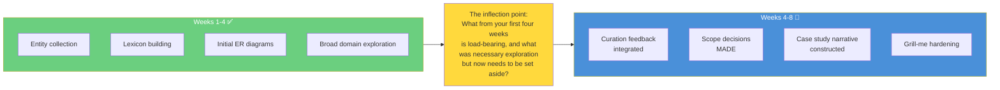
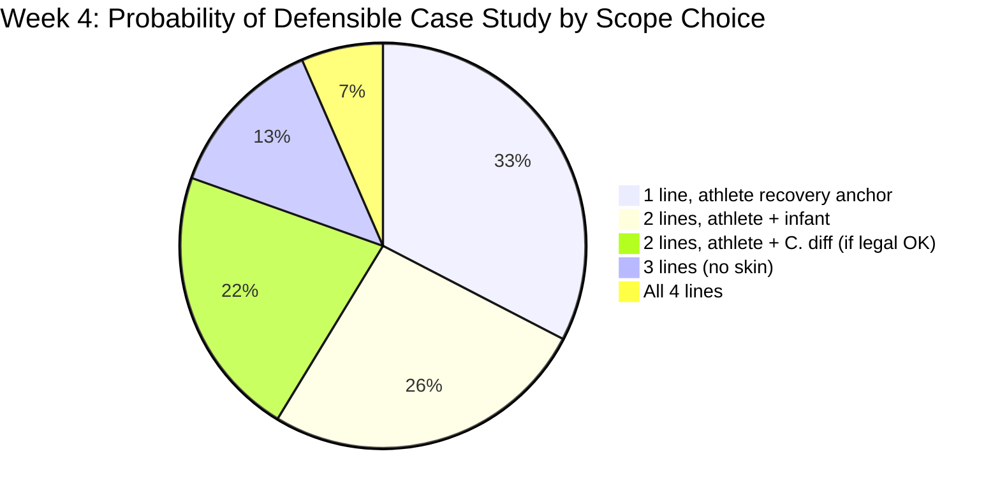
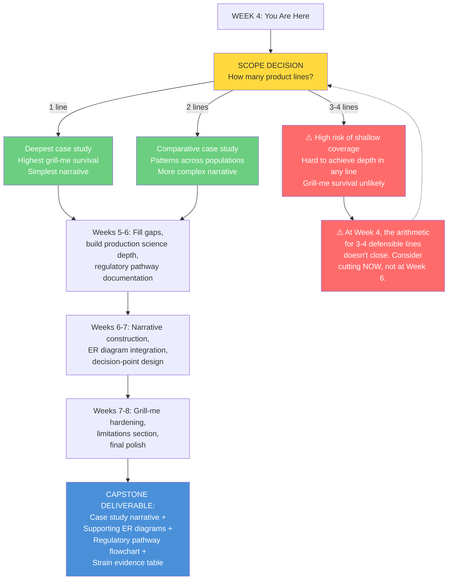

# Mid-Program Analysis: Probiotic Lifecycle Case Study — From Exploration to Focus

**For:** Intern A
**Domain:** Fermented Foods, Microbes, Nutrients & Human Health
**Phase:** Week 4 → Curation-I / Research-II / Synthesis / Polish
**Context:** You've spent four weeks collecting entities, building your lexicon, and mapping the domain. Now the work shifts: from *what exists* to *what matters most* — and how it fits into a case study narrative that survives grill-me.

---

## 1. Where You Are

You are at the inflection point. The expansive, "collect everything" phase is over. The next four weeks are about **convergence**: selecting, narrowing, integrating, and building a coherent narrative. This is the hardest part of research — and where the most learning happens.

---

## 2. What This Analysis Is

This document applies four analytical methodologies to help you **make scope decisions and narrative choices** — not to tell you what to do, but to surface the tradeoffs you're navigating and the questions that will sharpen your focus.

| Methodology | What It Asks | Your Application |
|-------------|-------------|-----------------|
| **Grill-Me** | "What cracks under pressure?" | Which of your product lines can survive expert questioning? Which are shallow? |
| **Essentialist** | "What can I delete?" | Of everything you've collected in Weeks 1-4, what actually belongs in the final case study? |
| **Hypothesis-Framer** | "What question am I actually answering?" | What is the ONE central argument of your case study narrative? |
| **Superforecasting** | "What's the base rate for success?" | Given where you are now, what's the calibrated probability of a defensible case study — and what moves that number? |

### 2.1 How This Was Produced

A sub-agent (separate AI instance, no access to your work or conversations) was given: your case study framing, the four skill definitions, the internship specification, and the instruction: *"The intern is at Week 4. Entity collection is done. Apply all four methodologies to help them converge on a focused case study for Weeks 4-8."*

---

## 3. The Week 4 Audit: Questions to Ask Yourself Before You Proceed

Before you read the rest of this analysis, answer these questions honestly. They're designed to reveal what's solid vs. what's fragile in your current research:

| # | Auditing Question | Why It Matters |
|---|------------------|----------------|
| 1 | Which product line has the **strongest entity collection** — the most named strains, the clearest regulatory pathway, the best ER diagram? | Your anchor product should be the one you know best |
| 2 | Which product line has the **weakest entity collection** — the fewest sources, the most "[Unverified]" flags, the thinnest scientific backing? | This is your first candidate for cutting |
| 3 | If you had to **present your case study tomorrow**, which product line would you feel confident defending in a grill-me? Which would make you nervous? | Gut-check: confidence is a signal |
| 4 | What's the **single most interesting thing** you've learned in Weeks 1-4? Not the most important — the most *interesting*. | Your narrative should center on what genuinely fascinates you |
| 5 | What's the **one thing you researched that you now suspect was a dead end** — something that sounded important but led nowhere? | Every researcher has these. Name them. Let them go. |
| 6 | Across your four product lines, **where is the evidence strongest? Where is it weakest?** Be specific — name the best paper for each line and the biggest evidence gap. | Your case study's credibility rests on evidence quality, not quantity |

---

## 4. The Convergence Decision: Four Frameworks, One Question

All four methodologies were applied to the same question: **"Given that the intern is at Week 4 with entity collection complete, what's the optimal scope for the remaining four weeks?"**

Here's what each found:

### 4.1 Grill-Me Convergence Assessment

| Product Line | Survival Assessment | Key Vulnerability |
|-------------|-------------------|-------------------|
| **Athlete recovery** | Likely survivable | Evidence is moderate (3-5 RCTs), but regulatory pathway is simplest and connection to fermentation science is strongest |
| **Infant colic** | Likely survivable | Strongest evidence base (multiple RCTs, Cochrane reviews exist); specific Swiss precedent (Suri Biotech); infant formula regulation is well-defined |
| **C. diff recovery** | Conditional | Evidence is strong but regulatory classification is uncertain — is this a food or a drug? This question MUST be resolved before committing |
| **Skin health / cosmetics** | Fragile | Thinnest evidence (1-3 RCTs, mostly preclinical); "living cosmetics" is a contested category; weakest connection to fermented foods domain |

**Grill-Me's recommendation:** Cut to 1-2 product lines. If 1: athlete recovery (simplest path to depth). If 2: athlete + infant (strongest evidence-to-complexity ratio across both). C. diff is high-value but high-risk — treat as conditional. Skin health is the clear first cut.

### 4.2 Essentialist Week-4 Pruning

The essentialist methodology identifies what you can safely set aside from your Weeks 1-4 research — materials you collected that were valuable exploration but don't need to appear in the final case study:

| Research Area | Status | Rationale |
|--------------|--------|-----------|
| **Traditional Swiss food knowledge** | **Set aside** | Unless you have a specific, cited, product-relevant practice — it's color, not structure |
| **Swiss startup ecosystem (general)** | **Reduce to 1-2 paragraphs** | Innosuisse, EPFL/ETHZ — mention them as context, don't research them as a separate stream |
| **Nutrient composition analysis** | **Merge into production science** | Nutritional analysis is a subset of product characterization, not a standalone section |
| **Global probiotic market data** | **Set aside** | Market sizing requires proprietary data. Acknowledge market relevance without doing original market analysis |
| **Detailed regulatory comparison of all 4 lines** | **Focus on lines you keep** | Don't research regulation for product lines you're cutting |

**What MUST stay:**
- Production science (fermentation methods, strain selection, viability maintenance)
- Clinical evidence synthesis for KEPT product lines
- Regulatory pathway for KEPT product lines (Swiss + EU)
- Case study narrative structure

### 4.3 Hypothesis-Framer: Your Central Pivot Question

The most important thing you can do in Week 4 is articulate the **ONE question your case study answers**. Not four questions — one. Everything in your final deliverable should trace back to this question.

**Option A — The Single-Product Depth Question:**
> *"For [athletes / infants / C. diff patients], what does it take to bring a scientifically-grounded probiotic product from research to market in Switzerland — and what are the key decisions a startup founder would face?"*

**Option B — The Comparative Framework Question:**
> *"Across two distinct life stages — [e.g., infant gut colonization and athletic recovery] — what patterns emerge in probiotic product development: shared regulatory pathways, common production challenges, and diverging evidence requirements?"*

**Option C — The 'Why Not All Four' Question:**
> *"What happens when a startup attempts to design a product line spanning four life stages — and where does the science, regulation, or economics force hard tradeoffs?"*

**Which question feels most like YOUR case study?** Pick one. The other two become things you acknowledge in a "Future Directions" section.

### 4.4 Superforecasting: Week-4 Calibrated Probabilities

Given that you're at Week 4 with entity collection done, the superforecasting methodology produced updated probabilities:

**What moves these numbers:** The single biggest probability mover at Week 4 is the **Week 4-5 curation review**. When Ivan or Matt reviews your entity collection and gives feedback, that signal will either confirm your direction or require a pivot. The earlier you surface the hard scope question to curation, the more time you have to act on the answer.

**If you haven't already, bring the scope question to the next curation review.** "Here's what I've collected across four product lines. Here's my assessment of evidence strength and regulatory complexity for each. I'm considering cutting to [1/2] lines — what do you think?"

---

## 5. Your Convergence Roadmap: Weeks 4-8 by Phase

### Week 4-5: Curation-I — The Scope Decision

**What you're doing:**
- Curation review of Weeks 1-4 artifacts is happening NOW
- This is where research professionals give you Merge/Revise/Defer/Discard decisions
- This is also where YOU make your scope decision

**Questions to bring to curation:**

> *"Across my four product lines, where do you see the deepest entity collection? Where do you see gaps I might not recognize?"*

> *"For the C. diff product line — is the Swiss regulatory classification (food vs. drug) something I can resolve, or is it genuinely unsettled?"*

> *"If I cut to two product lines, which two would you recommend — and why?"*

> *"What's the single biggest weakness in my entity collection that I should address before building the narrative?"*

**Decision you must make by end of Week 5:**
- How many product lines (1, 2, or — with strong justification — 3)
- Which ones
- What's scoped OUT (explicitly — write it down)

### Week 5-6: Research-II — Addressing Gaps, Building Depth

**What you're doing:**
- Fill gaps identified in curation feedback
- Go deep on production science for your chosen product line(s)
- Build the regulatory pathway documentation for your chosen line(s)
- Start sketching the case study narrative structure

**What you're NOT doing:**
- Opening new research streams
- Chasing interesting tangents that don't serve the chosen product line(s)
- Researching product lines you've cut

**Questions to guide this phase:**

> *"What specific strains, with specific designations (e.g., L. reuteri DSM 17938, not just 'Lactobacillus'), anchor my product claims?"*

> *"What does the production process actually look like — batch fermentation? Substrate? Downstream processing? Quality control for viable cell counts?"*

> *"For my chosen product line(s), what's the step-by-step Swiss regulatory pathway? What's the competent authority? What's the timeline?"*

> *"What's the best paper I've found for each product claim — and what's the most honest description of what it actually demonstrated?"*

### Week 6-7: Synthesis — Building the Narrative

**What you're doing:**
- Construct the case study narrative
- Integrate ER diagrams into the story
- Build supporting materials (flowcharts, comparison tables, regulatory pathway diagrams)
- Run self-administered grill-me questions

**Narrative structure for your case study:**

A business case study is not a research paper. It tells a story. Here's a structure that works:

1. **The Company** — Who is the fictional startup? What's their mission? Why probiotics? Why Switzerland? (1-2 pages)
2. **The Problem** — What specific health need are they addressing? Why isn't it adequately served? (1-2 pages)
3. **The Science** — What's the evidence? Which strains? What do the best studies actually show? Be precise, be honest about limitations. (3-5 pages — this is where depth lives)
4. **The Product(s)** — What are they making? How is it produced? What are the production science specifics? (2-3 pages)
5. **The Regulatory Path** — Step by step: what does Swiss/EU regulation require? Where are the friction points? (2-3 pages)
6. **The Market & Business Model** — Who buys this? Through what channel? At what price? What's the competitive landscape? (1-2 pages)
7. **Decision Points** — 2-3 moments where the founder must choose between alternatives, and the tradeoffs of each choice. This is where the reader engages. (2-3 pages)
8. **Limitations & Open Questions** — What's unknown? What would you need to know to be more confident? What's explicitly scoped out? (1 page)

**Questions to guide your narrative construction:**

> *"What's the most surprising thing I learned that the reader should also find surprising?"*

> *"If someone read ONLY the decision points section, would they understand the core tradeoffs in probiotic product development?"*

> *"Where in the narrative do my ER diagrams add value — and where are they decorative? Every diagram should earn its place."*

> *"Can I state, in one sentence, what this case study argues? If I can't, the reader won't know either."*

### Week 7-8: Polish — Hardening for Grill-Me

**What you're doing:**
- Run the full grill-me skill against your case study
- Address weak spots identified in self-interrogation
- Clean up supporting materials (ER diagrams, flowcharts, references)
- Prepare the repository for final review

**Grill-me self-test questions (escalating):**

| Level | Self-Test Question |
|-------|-------------------|
| **1. Recall** | "Can I define every key term in my case study — lacto-fermentation, CFU, GRAS, QPS, novel food, Wessel criteria — without looking them up?" |
| **2. Mechanism** | "Can I explain how Lactobacillus converts sugars to lactic acid? What happens at the metabolic pathway level? What conditions optimize the process?" |
| **3. Rationale** | "Why did I choose L. reuteri DSM 17938 over other probiotic strains? What's the tradeoff? What would break if I chose a different strain?" |
| **4. Edge Cases** | "What happens if a consumer takes my product while on antibiotics? What happens if the cold chain breaks during distribution? What if a competitor publishes a negative trial of my strain?" |
| **5. Synthesis** | "If I had to design a monitoring system for small-scale Swiss probiotic fermenters to ensure batch-to-batch consistency, what would it look like? What parameters would I track? What thresholds would trigger an intervention?" |

---

## 6. Diagram: Your Convergence Path

---

## 7. What to Let Go Of

Every researcher at Week 4 has material they collected that won't make the final cut. This is not failure — it's convergence. Name what you're setting aside:

| Material to Possibly Set Aside | Why |
|-------------------------------|-----|
| Broad Swiss food ecosystem mapping (all producers, all institutions) | Keep what's relevant to your specific product line(s); set aside the rest |
| Deep-dive research on product lines you cut | Valuable learning experience. Don't delete it — just don't build the case study around it |
| General microbiome science overviews | You needed these to orient. Now you need strain-specific depth |
| Traditional knowledge research (unless you found something concrete) | If you can't name a specific practice → strain → product-design chain, it's color, not structure |
| Early, broad ER diagrams trying to capture everything | Replace with focused ER diagrams showing the specific strain-to-health-outcome-to-regulatory pathway for your chosen product(s) |

---

## 8. Tangible Week 4-8 Resources

These are resources to help you build DEPTH, not breadth. Use them to fill gaps, not open new frontiers:

### 8.1 For Production Science Depth

| Resource | What To Extract |
|----------|----------------|
| Fenster et al. (2019), *Microorganisms* — "The production and delivery of probiotics" | Batch fermentation parameters, downstream processing, CFU viability, quality control |
| Hutkins (2019), *Microbiology and Technology of Fermented Foods* | Fermentation science fundamentals — pick the chapters on lactic acid bacteria |
| ISAPP infographics and consensus papers | Accessible summaries of probiotic definitions, production, and evidence standards |

### 8.2 For Regulatory Depth (Swiss + EU)

| Resource | What To Extract |
|----------|----------------|
| FSVO (blv.admin.ch) — novel food guidance | Step-by-step Swiss novel food authorization process |
| Swiss FDHA Ordinance on Food for Persons with Special Nutritional Needs | Infant formula regulation specifics |
| EU Regulation 1924/2006 | Nutrition and health claims — what you can and cannot say about your product |
| Swissmedic — borderline product guidance | For the C. diff line: where is the food/drug boundary? |
| EFSA Novel Food Catalogue | Check strain status: does your chosen strain have EU novel food authorization? |

### 8.3 For Clinical Evidence Synthesis

| Product Line | Start With |
|-------------|-----------|
| Infant colic | Sung et al. (2014), *Pediatrics*; Schreck Bird et al. (2017) meta-analysis; Ong et al. (2019) updated review |
| Athlete recovery | Jäger et al. (2019) ISSN position stand; Huang et al. (2019) L. plantarum TWK10 study |
| C. diff recovery | Goldenberg et al. (2017) Cochrane review; McDonald et al. (2018) IDSA/SHEA guidelines |
| Skin health | Nakatsuji et al. (2017); Puebla-Barragan & Reid (2021) review — but consider whether this line survives your scope decision |

### 8.4 For Narrative Structure

| Resource | What To Extract |
|----------|----------------|
| Ivey Publishing free cases (iveypublishing.ca) | Study how business cases structure their narrative — the company intro, the problem statement, the decision points |
| MIT Sloan LearningEdge cases | Free, well-structured business cases — study the format, not the content |
| Wharton Knowledge@Wharton articles | How business academics translate research into accessible narratives |

---

## 9. How to Use This Document at Week 4

### 9.1 Read It With Your Entity Collection Open

Don't read this in the abstract. Have your GitHub repo open. Have your entity lists open. Have your ER diagrams visible. The questions in this document should interact with YOUR actual research, not with the hypothetical case study.

### 9.2 Make the Scope Decision Within One Week

You have until the end of Week 5 to decide how many product lines you're keeping. **Earlier is better.** Every day you spend on a line you later cut is a day stolen from the lines you keep. The Week 4-5 curation review is your decision trigger — use it.

### 9.3 Bring This Document to Curation

Show Matt or Ivan Section 3 (the Week 4 Audit) and Sections 4.1-4.4 (the four-methodology convergence findings). Say: "Here's what an adversarial analysis found. Here's where I agree. Here's where I disagree. Here's what I'm thinking about cutting. What do you think?"

### 9.4 Track Your Scope Decision Explicitly

Create a file in your repo: `SCOPE_DECISION.md`. Write down:
- How many product lines you're keeping
- Which ones
- What's explicitly cut
- Why (cite the evidence assessment, regulatory complexity, time constraint)
- What's the ONE central question your case study answers

This document serves three purposes: it forces you to commit, it documents your reasoning for curation, and it prevents scope creep in the final weeks.

---

## Appendix: Methodology Notes

This analysis was produced by applying four agent skills (grill-me, essentialist, hypothesis-framer, superforecasting) to the intern's case study framing, with the explicit instruction that the intern is at Week 4 and entity collection is complete. The methodologies are:

- **Grill-Me** — adversarial stress-testing; see grill-me skill (`~/.agents/skills/grill-me/SKILL.md`)
- **Essentialist** — eliminative interrogation via 3-gate loop; see essentialist skill (`~/.agents/skills/essentialist/SKILL.md`)
- **Hypothesis-Framer** — FINER + PICO framework; see Willis (2023), *Respiratory Care* 68(8):1180–1185; hypothesis-framer skill (`~/.agents/skills/hypothesis-framer/SKILL.md`)
- **Superforecasting** — calibrated probability estimation; see Tetlock & Gardner (2015), *Superforecasting*; superforecasting skill (`~/.agents/skills/superforecasting/SKILL.md`)

The analysis was performed by a sub-agent with no access to the intern's actual research, personal information, or conversation history. It is a navigational tool, not an evaluation.

---

*Analysis produced 2026-07-03 for Week 4 convergence. Version 2.0.0 — mid-program edition.*
