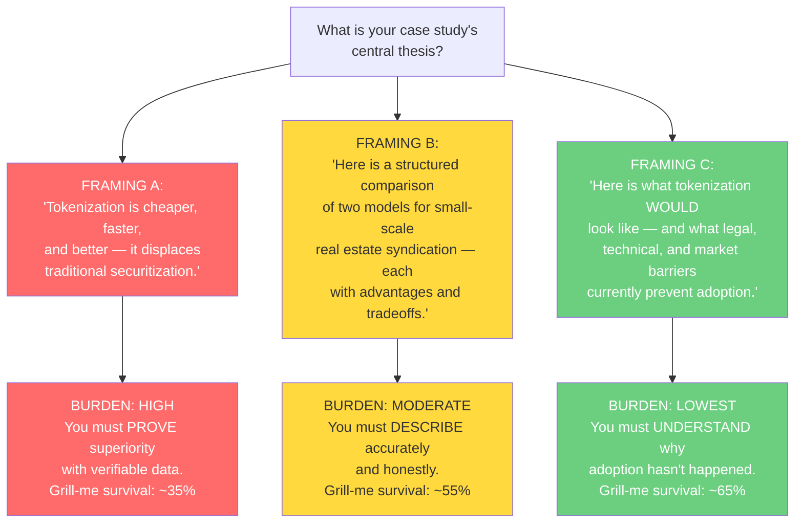
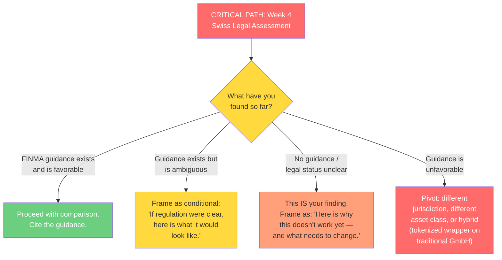
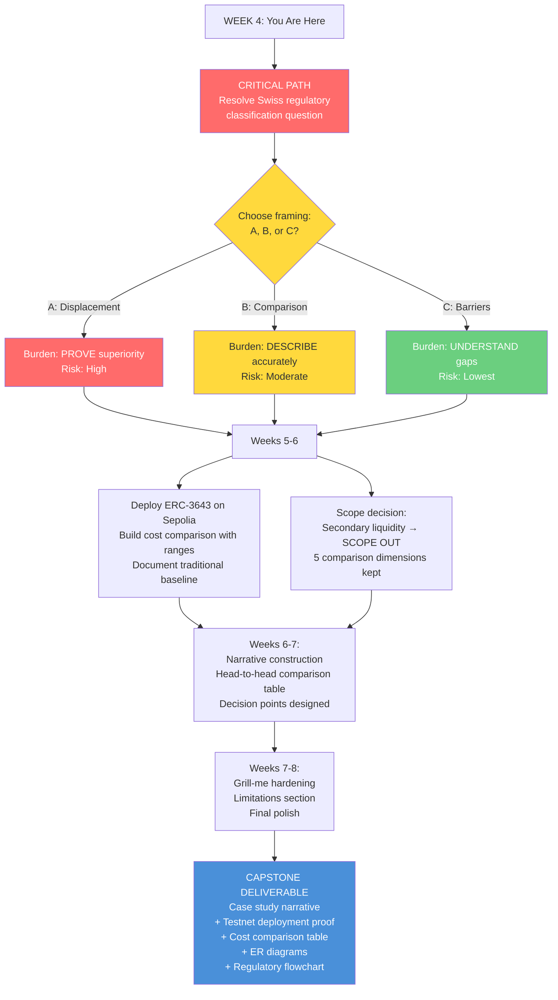

# Mid-Program Analysis: Tokenization vs. Securitization — From Exploration to Focus

**For:** Intern B
**Domain:** Real-World Asset (RWA) Tokenization
**Phase:** Week 4 → Curation-I / Research-II / Synthesis / Polish
**Context:** You've spent four weeks collecting entities, exploring token standards, mapping the traditional securitization landscape, and building your domain lexicon. Now the work shifts: from *what exists* to *what's the argument* — and how to build a case study narrative that survives grill-me.

---

## 1. Where You Are

```mermaid
flowchart LR
    subgraph Done["Weeks 1-4 ✅"]
        A1[Token standards explored]
        A2[Securitization landscape mapped]
        A3[Regulatory entities collected]
        A4[Initial ER diagrams built]
    end

    subgraph Now["Weeks 4-8 🎯"]
        B1[Curation feedback integrated]
        B2[Core thesis sharpened]
        B3[Testnet deployment completed]
        B4[Case study narrative constructed]
        B5[Grill-me hardening]
    end

    Done --> Q["The inflection point:<br/>You've mapped the territory.<br/>Now: what's your argument,<br/>and what evidence supports it?"]

    Q --> Now

    style Done fill:#6bcf7f,color:#fff
    style Now fill:#4a90d9,color:#fff
    style Q fill:#ffd93d,color:#333
```

You are at the inflection point. The expansive entity-collection phase is over. The next four weeks are about **building the argument** — selecting your evidence, constructing your comparison, deploying the technical demonstration, and weaving it all into a narrative that a grill-me interrogator can't dismantle.

---

## 2. What This Analysis Is

This document applies four analytical methodologies to help you **make argument and scope decisions** in the convergence phase. It is not a research plan. It is a set of questions, perspectives, and decision frameworks.

| Methodology | What It Asks | Your Week 4 Application |
|-------------|-------------|------------------------|
| **Grill-Me** | "What cracks under pressure?" | Which of your comparison claims can survive adversarial questioning? Which are assumptions dressed as conclusions? |
| **Essentialist** | "What can I cut?" | Of everything you've collected, what's load-bearing for your final argument? What was valuable exploration that doesn't need to appear? |
| **Hypothesis-Framer** | "What question am I actually answering?" | What is the ONE central thesis of your case study? Can you state it in a single, testable sentence? |
| **Superforecasting** | "What's the base rate for my claim?" | Given where you are at Week 4, what's the probability your case study survives grill-me — and what single decision most moves that number? |

### 2.1 How This Was Produced

A sub-agent (separate AI instance, no access to your work or conversations) was given: your case study framing, the four skill definitions, the internship specification, and the instruction: *"The intern is at Week 4. Entity collection is done. Apply all four methodologies to help them converge on a focused case study for Weeks 4-8 — surfacing the argument choices, scope decisions, and questions that will determine whether the final case study survives grill-me."*

---

## 3. The Week 4 Audit: Questions to Ask Yourself

Before you read the rest of this analysis, answer these questions honestly:

| # | Auditing Question | Why It Matters |
|---|------------------|----------------|
| 1 | What's the **strongest entity collection** you've built — token standards? Regulatory frameworks? Traditional securitization? Cost data? | Your anchor should be what you know best |
| 2 | What's **missing** that you expected to find — specific cost numbers? Swiss legal clarity? A real tokenized real estate example at your developer's scale? | Gaps to fill vs. gaps to acknowledge as limitations |
| 3 | If you had to **defend your case study tomorrow**, what claim would feel solid? What claim would make you nervous? | The nervous ones are either weak points or cut candidates |
| 4 | Have you found a **Swiss legal opinion, FINMA statement, or law firm publication** that directly addresses tokenized real estate partnerships? | This is your critical-path uncertainty |
| 5 | Do you have **actual cost numbers** — or ranges — for Swiss syndication? For smart contract audits? For on-chain KYC? | If not, your cost comparison is speculative. That's OK — IF you acknowledge it |
| 6 | Across your six comparison dimensions (cost, docs, speed, KYC, payments, liquidity), **which is strongest? Which is weakest?** | Your strongest anchors the argument. Your weakest: strengthen or scope out |

---

## 4. The Convergence Decision: Your Argument Choices

### 4.1 The Core Framing Decision

At Week 4, the single most important decision is **what claim your case study makes**:

**Which framing is most defensible given your actual research to date — and most useful to you as a learning experience?**

### 4.2 The Comparison Dimension Audit

Not all six dimensions are equal. At Week 4, audit each:

| Dimension | Grill-Me Assessment | Your Decision |
|-----------|-------------------|---------------|
| **Setup cost** | Potentially defensible IF you have actual cost ranges. But hidden costs (audit, legal opinion, gas) may offset savings. This is your linchpin dimension. | **Keep.** Model costs as RANGES, not point estimates. State every assumption. |
| **Documentation burden** | Which documents disappear? Which appear? The net change may be ambiguous — fewer traditional docs, new technical ones. | **Keep with nuance.** Don't claim "low-doc" — claim "different documents." |
| **Speed to close** | Plausible for investor onboarding. Less clear for total timeline (legal setup for novel token structure may be slower than established partnership law). | **Keep.** Be specific about which parts are faster and which aren't. |
| **KYC/AML onboarding** | Digital identity verification is faster per investor but has recurring provider fees. Traditional paper KYC is slower but no per-use fee. | **Keep.** This is likely your strongest operational advantage. |
| **Payment distribution** | Smart contracts CAN automate distributions. But gas costs are volatile and oracle maintenance is needed. | **Keep with caveats.** Model gas costs over 5 years with best/worst/expected. |
| **Secondary market liquidity** | **WEAKEST DIMENSION.** No secondary market exists for small private real estate partnerships in EITHER model. Tokens create technical possibility, not actual liquidity. | **Scope out.** Acknowledge as shared limitation. Frame as "what would need to change." |

### 4.3 The Critical-Path Question: Swiss Regulatory Clarity

**If you haven't resolved this question by now, resolve it THIS WEEK.** Everything else depends on the answer. If the answer is "unclear," that's not a failure — it's a finding.

---

## 5. Your Convergence Roadmap: Weeks 4-8 by Phase

### Week 4-5: Curation-I — Argument Sharpening

**What you're doing:**
- Curation review of Weeks 1-4 artifacts is happening NOW
- Sharpen your central thesis (choose Framing A, B, or C)
- Resolve the Swiss regulatory question definitively
- Audit comparison dimensions: keep, strengthen, or scope out

**Questions to bring to curation:**

> *"Here's what I've found on Swiss regulatory classification of tokenized real estate. Am I reading FINMA's guidance correctly? Is there something I'm missing?"*

> *"For the cost comparison — I have [X] data points. What am I missing?"*

> *"I'm considering scoping out secondary market liquidity as a shared limitation. Does that strengthen or weaken the case study?"*

> *"Which framing — advocacy, comparison, or barriers analysis — produces the most useful case study?"*

**Decision by end of Week 5:** Your central thesis. Which comparison dimensions stay. Whether Swiss legal assessment supports, conditions, or blocks your approach.

### Week 5-6: Research-II — Filling Gaps, Building Evidence

**What you're doing:**
- Fill gaps from curation feedback
- **Deploy your ERC-3643 testnet contract** — this is your technical anchor
- Build the cost comparison with ranges and explicit assumptions
- Document the traditional syndication baseline with specificity

**What you're NOT doing:**
- Opening new comparison dimensions
- Researching additional blockchain platforms (Ethereum/Sepolia is sufficient)
- Chasing edge cases that don't affect your core argument

**Questions to guide this phase:**

> *"Can I deploy an ERC-3643 token on Sepolia, set up a whitelist, mint tokens to 'investors,' and run a distribution — with transaction hashes in my case study?"*

> *"For each cost category, do I have at least a RANGE? If not, am I acknowledging the gap?"*

> *"What would a Swiss developer raising CHF 5M ACTUALLY do today — Crowdhouse? Foxstone? Direct syndication? Have I verified this against real Swiss practice?"*

> *"If I were the grill-me interrogator, what would I attack first in my cost comparison?"*

### Week 6-7: Synthesis — Building the Narrative

**Narrative structure:**

1. **The Developer** — Fictional Swiss developer. CHF 5M residential, 15 units, Zürich suburb. Track record. Why tokenization? (1-2 pages)
2. **The Traditional Path** — What would they normally do? Simple partnership? Crowdhouse? GmbH shares? Cost? Timeline? (2-3 pages)
3. **The Tokenized Alternative** — ERC-3643 on Ethereum. Smart contract for ownership + whitelist + distributions. Legal structure. **Here's where your testnet deployment earns its place.** (3-4 pages)
4. **Head-to-Head Comparison** — The table. Cost, docs, speed, KYC, payments. With ranges. With assumptions stated. **This is your centerpiece.** (2-3 pages)
5. **Decision Points** — 2-3 moments where the developer must choose. "The legal opinion on token classification costs CHF 40K and takes 6 weeks. The partnership agreement costs CHF 5K and takes 2 weeks. Is the tokenization advantage worth the upfront uncertainty?" (2-3 pages)
6. **Limitations** — What's unknown. What's scoped out. Secondary liquidity. Cross-border investors. Regulatory evolution. (1 page)

**Questions to guide your narrative:**

> *"If someone reads ONLY the head-to-head comparison table, do they understand my argument?"*

> *"Can I state my central thesis in one sentence? If a grill-me interrogator asked 'What is this case study actually arguing?' — can I answer without hesitating?"*

> *"What would the TRADITIONAL investment banker say about my comparison? Have I represented their model fairly, or built a straw man?"*

### Week 7-8: Polish — Hardening for Grill-Me

**Grill-me self-test questions (escalating):**

| Level | Self-Test Question |
|-------|-------------------|
| **1. Recall** | "Can I define ERC-3643, FinSA, FINMA, SPV, AMLA, KYC, gas, Sepolia — in one sentence each, without looking them up?" |
| **2. Mechanism** | "How does an ERC-3643 token enforce transfer restrictions? What happens when an unwhitelisted address tries to receive tokens? Walk me through the code path." |
| **3. Rationale** | "Why ERC-3643 and not ERC-20? Why Ethereum and not a private chain? Why tokenization and not just a better GmbH structure? What are the actual tradeoffs?" |
| **4. Edge Cases** | "What happens when the developer defaults? How do token holders enforce their rights? What if an investor loses their private key? What if FINMA reclassifies the token mid-project?" |
| **5. Synthesis** | "If you were designing regulatory framework for tokenized real estate from scratch — what would you change about Swiss law? What's the minimum viable regulation?" |

---

## 6. Diagram: Your Convergence Path

---

## 7. What to Let Go Of

At Week 4, convergence means making hard choices:

| Material to Set Aside | Why |
|-----------------------|-----|
| Broad comparison of 5+ blockchain platforms | Pick Ethereum + ERC-3643. Justify in one paragraph. Move on. |
| Deep-dive on global securitization regulation (EU, US, Asia) | Scope: Switzerland. Acknowledge jurisdictional variation as limitation. |
| Asset valuation frameworks (Damodaran, DCF) | Valuation is identical across both models. A building is worth what it's worth. |
| Secondary market liquidity analysis | Scoped out. Acknowledge as shared limitation. |
| Early, broad ER diagrams of the entire tokenization ecosystem | Replace with focused diagrams: ownership model, payment flow, regulatory decision tree |

---

## 8. Tangible Week 4-8 Resources

### 8.1 For the Testnet Deployment (Technical Anchor)

| Resource | What To Do |
|----------|-----------|
| **ERC-3643 EIP Specification** (eips.ethereum.org) | Read the spec. Understand identity registry, transfer manager, compliance rules. |
| **Tokeny Solutions Documentation** | Reference implementation. Study their architecture. |
| **OpenZeppelin Contracts** | Build on audited, standard contracts. |
| **Sepolia Testnet** (via Alchemy, Infura, or public RPC) | Deploy here. Show transaction hashes in your case study. |
| **Hardhat or Foundry** | Development environment. |
| **Remix IDE** | Fastest prototype-and-verify path. |

**Target:** Deployed ERC-3643 token on Sepolia with minted tokens, whitelist with 3-5 addresses, distribution transaction, verified contract on Etherscan, screenshots/hashes in your case study.

### 8.2 For the Cost Comparison

| Resource | What To Extract |
|----------|----------------|
| Swiss law firm websites (DLA Piper, Lenz & Staehelin, MME) | Client alerts on token regulation — may include cost estimates |
| Crowdhouse / Foxstone | What do Swiss real estate crowdfunding platforms charge? Your traditional baseline. |
| Smart contract audit firms (Trail of Bits, OpenZeppelin, Consensys Diligence) | Audit cost ranges ($50K–$200K is a defensible estimate) |
| KYC/AML providers (Fractal, Synaps, Onfido) | Pricing pages, integration costs |
| Ethereum gas trackers | Current gas costs; extrapolate for distributions × investors × years |

### 8.3 For Swiss Regulatory Research

| Resource | What To Extract |
|----------|----------------|
| FINMA Circulars and Guidance | Token classification framework. ICO guidelines. Fintech license requirements. |
| Swiss DLT Act (2021) | Legal framework for DLT — does it cover your use case? |
| FinSA / FinIA | Prospectus requirements, intermediary licensing |
| Swiss Code of Obligations (OR) | Partnership law, GmbH law — the traditional side |
| Law firm publications | Search: "tokenized real estate Switzerland," "security token FINMA" |

### 8.4 For Narrative Structure

| Resource | What To Extract |
|----------|----------------|
| Ivey Publishing free cases (iveypublishing.ca) | Study business case narrative structure — company intro, problem statement, decision points |
| MIT Sloan LearningEdge cases | Free, well-structured cases — study the format |
| arXiv 2503.01111 | Exploration on RWAs & Tokenization — includes Aspen Ridge Resort case study as precedent |
| RWA.xyz | Live data on tokenized RWA market — cite in your case study for context |

### 8.5 Real Platforms to Study

| Platform | Why |
|----------|-----|
| **Tokeny Solutions** | ERC-3643 creator — study their documentation |
| **Securitize** | Major competitor — compare approaches |
| **RealT** | Tokenized US real estate with rental distributions (US-based, but the model is relevant) |
| **Crowdhouse** | Swiss real estate crowdfunding — your traditional comparator |
| **Foxstone** | Swiss fractional real estate — another traditional comparator |
| **Mt Pelerin** | Swiss tokenization platform (Geneva-based) |
| **Sygnum** | Swiss digital asset bank — institutional-grade infrastructure |

---

## 9. How to Use This Document at Week 4

### 9.1 Read It With Your Repo Open

Have your entity collections, ER diagrams, and research notes visible. The questions here should interact with YOUR actual research.

### 9.2 Make the Argument Decision Within One Week

By end of Week 5: choose your framing (A, B, or C), audit your comparison dimensions, resolve the Swiss legal question definitively. Every day spent on a dimension you later cut is stolen from the ones you keep.

### 9.3 Bring This Document to Curation

Show Matt or Ivan Section 3 (Week 4 Audit) and Section 4 (Framing Decision). Say: "Here's what the analysis found. Here's where I agree. Here's where I disagree. Here's what I'm thinking. What do you think?"

### 9.4 Create a SCOPE_DECISION.md

In your repo, write down:
- Your central thesis (one sentence)
- Which framing (A, B, or C)
- Which comparison dimensions are in, which are out, and why
- Your Swiss legal assessment — favorable, conditional, or blocking
- What's explicitly scoped out

This commits you, documents your reasoning, and prevents scope creep.

---

## Appendix: Methodology Notes

This analysis was produced by applying four agent skills (grill-me, essentialist, hypothesis-framer, superforecasting) to the intern's case study framing, with instruction that the intern is at Week 4 and entity collection is complete. Methodologies:

- **Grill-Me** — adversarial stress-testing; see `~/.agents/skills/grill-me/SKILL.md`
- **Essentialist** — eliminative interrogation via 3-gate loop; see `~/.agents/skills/essentialist/SKILL.md`
- **Hypothesis-Framer** — FINER + PICO; see Willis (2023), *Respiratory Care* 68(8):1180–1185; `~/.agents/skills/hypothesis-framer/SKILL.md`
- **Superforecasting** — calibrated probability estimation; see Tetlock & Gardner (2015), *Superforecasting*; `~/.agents/skills/superforecasting/SKILL.md`

The analysis was performed by a sub-agent with no access to the intern's actual research, personal information, or conversation history. It is a navigational tool, not an evaluation.

---

*Analysis produced 2026-07-03 for Week 4 convergence. Version 2.0.0 — mid-program edition.*
