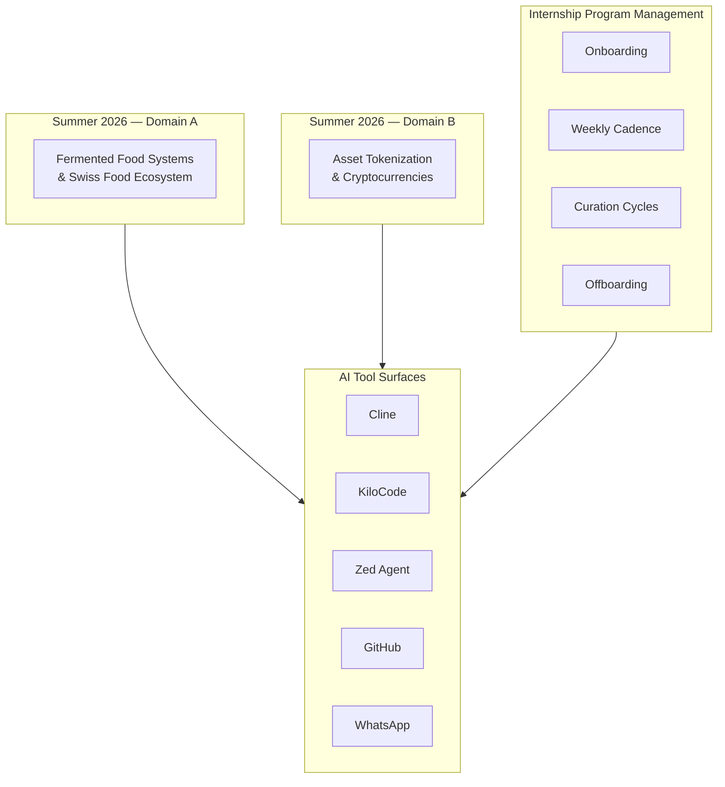
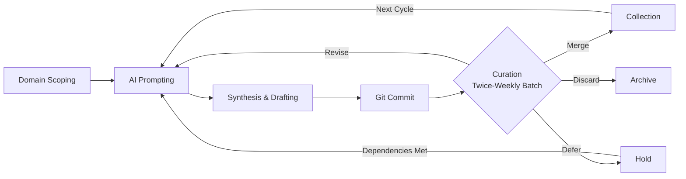
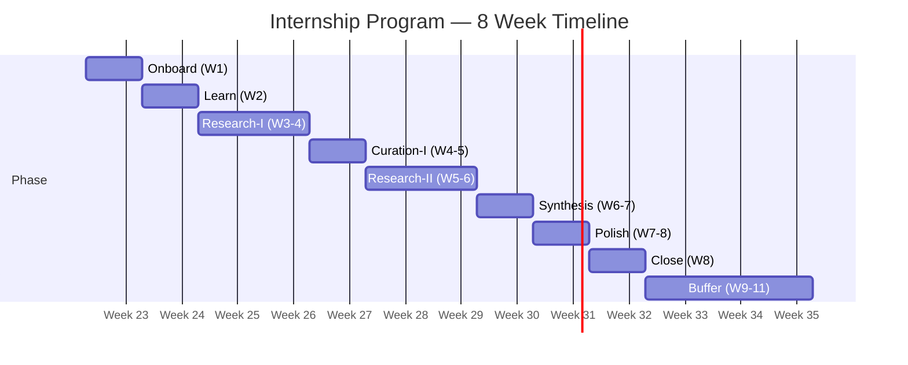

# Axolotl Summer Internship Program — Specification

**Note for interns:** This document uses the DDMVSS framework (Domain-Driven Minimum Viable Specification Set) — a specification methodology adapted from software architecture to program design. Terms like "hLexicon," "bounded context," "OCAP boundaries," and "ν-event types" are DDMVSS vocabulary. Intern-facing documents use simplified equivalents (e.g., "lexicon" instead of "hLexicon"). They refer to the same concepts. You do not need to understand DDMVSS deeply to use this specification — the table of contents below will route you to the parts relevant to your questions.

**Purpose:** The minimum viable specification set for the Axolotl Partners summer internship program — an 8-week, AI-enabled research program for 1-3 interns, each pursuing a self-selected domain in collaboration with the Axolotl research team.

**Core Axioms:**

- **Learning-first, not output-first.** Artifacts are vehicles for skill acquisition. The intern walking away with new capabilities is the primary metric of success.
- **Engagement over cross-pollination.** Each intern works a domain they are genuinely passionate about, co-selected through 10-20 hours of pre-program discussion.
- **Struggle is productive.** Learning new things is hard. The program encourages productive struggle while providing a release valve before frustration sets in.
- **The intern is the documentation.** Artifacts may not be fully self-documenting; the intern carries the context. Post-program consulting follow-ups are expected and welcomed.

**Focusing Assumptions:**

| ID | Statement | Rationale |
|----|-----------|-----------|
| FA-1 | WhatsApp is the coordination surface; GitHub is the persistence surface | Zero adoption cost for the Axolotl team; curation decisions are captured in repo |
| FA-2 | Interns start with GitHub + one AI coding agent (Cline), not all four | 20 hours is enough to get started with one; others adopted as needed |
| FA-3 | Intern capacity is hard-capped at (Axolotl team size - 1) | With 4 team members, max 3 interns; program does not scale beyond this |
| FA-4 | Domain topics are co-selected with the intern pre-program | 10-20 hours of pre-internship discussion ensures genuine engagement |
| FA-5 | Program can extend up to 3 weeks beyond the 8-week timeline | Life happens; 37.5% slack buffer built in |

---

## 1. Domain — Bounded Contexts & hLexicon

### 1.1 Bounded Contexts

### 1.2 Internship Lexicon

A lexicon is the dictionary of terms that have specific meaning within a domain. In the context of AI tools, these words are not just labels — they are tools (the right term unlocks new prompting capabilities), actions (naming something lets you ask the AI to do things with it), and maps (each term is a node in your entity-relationship diagram). The intern builds their lexicon throughout the program, starting from Week 1.

| Term | Context | Definition |
|------|---------|------------|
| `lexicon` | Concept | The dictionary of terms with specific meaning in a domain. In AI context, words are tools, actions, and maps — each term is a node in the entity-relationship framework. |
| `research-cycle` | FlowDef | A single iteration of AI-enabled inquiry: prompt → synthesize → document → commit → curate |
| `entity` | Concept | Anything that exists in the domain — a person, organization, concept, object, or process that can be named, described, and placed in an ER diagram |
| `relationship` | Concept | How two entities connect — the verbs that link entities (researches, produces, regulates, enables) |
| `er-diagram` | Artifact | A mermaid entity-relationship diagram that visualizes the domain's entities and their relationships |
| `artifact` | Entity | Any markdown doc, code file, CSV, JSON, PDF, or agent skill produced by an intern and stored in their GitHub repository |
| `research-professional` | Role | A member of the Axolotl Partners research team (Matt, Mike, Ivan, Mario) providing curation, guidance, and domain expertise |
| `tool-session` | Entity | A bound interaction session with an AI tool (Cline, KiloCode, Zed Agent) |
| `check-in` | Event | A WhatsApp message in the Axolotl Interns group providing status update, question, or request for help |
| `deliverable` | Artifact | The capstone repository — a GitHub repo containing a report, program, website, or combination that demonstrates domain syntax/semantics understanding |
| `onboarding` | Phase | Week 1: account provisioning, GitHub + one AI agent familiarization, domain scoping |
| `cadence` | FlowDef | The weekly rhythm: research cycles punctuated by twice-weekly batch curation |
| `curation-decision` | Event | A Merge/Revise/Defer/Discard evaluation provided by research professionals during batch review |
| `batch-review` | Event | Twice-weekly review of accumulated artifacts by one or more research professionals |
| `syntax` | Concept | The mechanics of how things are done in the domain — procedures, methods, technical processes. In the entity-relationship framework, syntax describes what entities *do* and how they operate. |
| `semantics` | Concept | The schemas and concepts that define and describe the meaning of the domain — taxonomies, models, frameworks. In the entity-relationship framework, semantics maps how entities *relate* and what those relationships *mean*. |
| `temporal-analysis` | Concept | How the domain's syntax and semantics are changing over time, including AI's role in reshaping both |
| `release-valve` | Mechanism | The WhatsApp group chat, available at any time when productive struggle becomes frustration |

### 1.3 Domain Scope — Summer 2026

#### Domain A: Fermented Food Systems & Swiss Food Ecosystem

| Dimension | Scope |
|-----------|-------|
| **Syntax** | Fermentation production methods, processes, techniques, equipment, Swiss production systems |
| **Semantics** | Fermentation taxonomy (types, organisms, biochemical pathways), food safety frameworks, Swiss food business network structure, Swiss food research institution landscape |
| **Temporal** | How AI/automation is changing fermentation processes; evolution of Swiss food regulations and markets |
| **Domain Expert** | Ivan (fermented food + software architecture + cryptocurrencies) |
| **Business Context** | Matt (domain business expert) |
| **AI Methodology** | Mario (AI research agents) |

#### Domain B: Asset Tokenization & Cryptocurrencies

| Dimension | Scope |
|-----------|-------|
| **Syntax** | Token standards (ERC-20, ERC-721, ERC-1155), smart contract deployment, DeFi protocol mechanics, blockchain infrastructure |
| **Semantics** | Tokenization models, regulatory frameworks, economic models, custody and ownership concepts, market structures |
| **Temporal** | Evolution of token standards, shifting regulatory landscapes, AI's role in DeFi and token analysis |
| **Domain Expert** | Ivan (fermented food + software architecture + cryptocurrencies) |
| **Business Context** | Matt (domain business expert) |
| **AI Methodology** | Mario (AI research agents) |

---

## 2. Capability — Verbs, Tools, and Grants

### 2.1 Capability Grant Table

| Verb | Resource | Tool Surface | Owner | Notes |
|------|----------|-------------|-------|-------|
| `prompt` | LLM model | Cline, KiloCode, Zed Agent | Intern | Primary research driver |
| `synthesize` | Research findings | Zed (markdown editor) | Intern | Framework development |
| `document` | Artifact | Zed, GitHub | Intern | Markdown, code, data |
| `commit` | Git repository | GitHub (Axolotl-Research org) | Intern | All artifacts version-controlled |
| `query` | Knowledge base | AI tools | Intern | Domain exploration |
| `build-skill` | Agent skill | Zed, Cline | Intern | Tool-specific or portable |
| `build-database` | Structured data | Zed, Cline | Intern | CSV/JSON only |
| `draw-er-diagram` | Entity relationships | Zed, Cline (mermaid) | Intern | Primary synthesis tool; maps entities to relationships |
| `export-pdf` | Documentation | Zed, pandoc | Intern | As needed |
| `check-in` | Status update | WhatsApp (Axolotl Interns group) | Intern | Async coordination |
| `curate` | Artifact | GitHub (review comments, issues) | Research Professional | Merge/Revise/Defer/Discard |
| `escalate` | Help request | WhatsApp (Axolotl Interns group) | Intern | Release valve |
| `navigate` | Team dynamics | WhatsApp, direct | Mike | Unblocks communication issues |
| `oversee` | Program quality | GitHub activity, WhatsApp | Matt | Program manager review |

### 2.2 AI Literacy Competency Topics

The intern must demonstrate understanding of:

| # | Topic | Description |
|---|-------|-------------|
| 1 | **Git & GitHub basics** | Clone, branch, commit, push, pull request, code review |
| 2 | **LLM prompting** | Prompt engineering, iteration, evaluating outputs, recognizing hallucinations |
| 3 | **LLM model ecosystem** | Model families, context windows, token limits, model selection |
| 4 | **MCP tools & agent skills** | Model Context Protocol, tool creation and consumption |
| 5 | **ACP & A2A agent protocols** | IBM Agent Client Protocol (part of A2A), Agent-to-Agent interoperability (Linux Foundation) |
| 6 | **AI workflow transformation** | How AI applications are reshaping work processes across domains |
| 7 | **Deterministic vs probabilistic compute** | Understanding that AI agents are non-deterministic; outputs require evaluation, not blind trust |
| 8 | **Entity-Relationship Modeling** | Mapping domain entities and their relationships using mermaid ER diagrams; defining semantic spaces |

### 2.3 AI Tool Overlap Policy

Cline, KiloCode, and Zed Agent overlap in functionality. Tool conflict is not a bug — it is a learning opportunity. Interns learn to:

- Recognize that AI agents are probabilistic, not deterministic
- Evaluate competing outputs and exercise judgment
- Choose and commit to a path when tools disagree
- Treat tool divergence as a prompt for deeper domain investigation

No tool-authority hierarchy is imposed. The intern develops the discernment to navigate tool disagreement.

---

## 3. Interface — Tool Surfaces

### 3.1 Tool Surface Inventory

| Surface | Tool | Account Type | Provisioned By | Purpose |
|---------|------|-------------|----------------|---------|
| **Cline** | cline bot | Individual account | Axolotl | AI-assisted coding and research |
| **KiloCode** | kilo.ai | Individual account | Axolotl | AI-assisted coding |
| **Zed Agent** | zed.dev | Individual account | Axolotl | AI-assisted editing |
| **GitHub** | Axolotl-Research org | Organization member | Axolotl | Repository storage, version control |
| **WhatsApp** | Axolotl Interns group | Group chat member | Matt | Coordination, check-ins, release valve |

### 3.2 Interface Equivalence

Unlike hKask (where MCP ≡ CLI ≡ API), the internship interfaces serve distinct purposes:

| Purpose | GitHub | WhatsApp | AI Tools |
|---------|--------|----------|----------|
| **Persistence** | ✅ Artifacts, review feedback | ❌ | ❌ |
| **Coordination** | ❌ | ✅ Check-ins, escalation | ❌ |
| **Research** | ❌ | ❌ | ✅ Prompting, synthesis |
| **Curation** | ✅ Review comments, issues | ⚠️ Informal feedback | ❌ |
| **Observability** | ✅ Commit history | ⚠️ Ephemeral | ⚠️ Session-scoped |

---

## 4. Composition — Research Workflow

### 4.1 Core Research Cycle

### 4.2 Composition Rules

1. **Every research cycle must produce an observable artifact.** No session without a commit.
2. **Curation latency is 3-4 days max** (twice-weekly batch). Interns continue producing during the wait.
3. **Composition is self-paced.** Interns drive their own cycle tempo within the weekly cadence.
4. **Escalation is always available.** WhatsApp release valve breaks any stuck composition.
5. **Tool choice is fluid.** Interns adopt additional AI tools (KiloCode, Zed) as their needs evolve.

---

## 5. Trust & Security

### 5.1 Access Control

| Concern | Policy | Status |
|---------|--------|--------|
| **Account provisioning** | Per-intern credentials for each tool surface | ✅ Pre-program |
| **GitHub repo permissions** | Axolotl-Research org membership; per-intern repository | ✅ |
| **Repository visibility** | Public repositories | ✅ (transparency, portfolio value for intern) |
| **Data sensitivity** | No proprietary Axolotl data in intern repos; all artifacts are intern-generated | ✅ |
| **Attribution** | Git author metadata on all commits | ✅ |
| **Offboarding** | Account access revoked at program conclusion | ⚠️ Process TBD |

### 5.2 Offboarding Protocol

At program close (Week 8, or Week 11 if extended):

1. Research professionals conduct final curation pass
2. Intern confirms all artifacts committed and pushed
3. Intern retains GitHub account; Axolotl-Research org access may be maintained for consulting follow-ups
4. Cline, KiloCode, Zed accounts: disposition determined by account type and licensing

---

## 6. Observability — Progress Tracking

### 6.1 Observable Signals

| Signal | Mechanism | Frequency | Consumer |
|--------|----------|-----------|----------|
| **Research activity** | GitHub commit history | Continuous | Research professionals, Matt |
| **Artifact growth** | Repository file count and structure | Weekly | Matt |
| **Curation decisions** | GitHub review comments | Twice-weekly | All research professionals |
| **Status check-ins** | WhatsApp group messages | As-needed / natural cadence | All |
| **Help requests** | WhatsApp escalation | On-demand | Matt ensures response |
| **Deliverable progress** | Repository completeness | Weekly | Ivan (domain), Mario (AI methodology) |

### 6.2 What Is NOT Measured

- Tool session counts or durations (not instrumented)
- Lines of code or word counts (quality over quantity)
- Time-to-completion metrics (self-paced within cadence)
- Comparative intern performance (learning-first, not competitive)

---

## 7. Persistence — Artifact Storage

### 7.1 Storage Schema

| Artifact Type | Storage Location | Format | Version Control |
|--------------|-----------------|--------|-----------------|
| **Markdown documents** | Intern's GitHub repo | `.md` | Git |
| **Code artifacts** | Intern's GitHub repo | Language-appropriate (`.py`, `.rs`, `.js`, etc.) | Git |
| **Databases** | Intern's GitHub repo | **CSV or JSON only** — no binary blobs (`.db`, `.sqlite`) | Git |
| **PDF files** | Intern's GitHub repo | `.pdf` | Git (Git LFS if large) |
| **Agent skills** | Intern's GitHub repo | Zed skill format or equivalent | Git |
| **WhatsApp history** | WhatsApp | WhatsApp-native | ⚠️ Ephemeral — critical decisions captured in GitHub review comments |

### 7.2 Database Policy

SQLite databases are generated during research but must be exported to **CSV or JSON** for repository storage. These text formats are:

- Diffable in Git
- Reviewable by research professionals
- Accessible without specialized tooling

Interns should store:
1. The exported CSV/JSON data files
2. A `schema.md` documenting table structures, column meanings, and relationships
3. Any generation/export scripts used

---

## 8. Lifecycle — 8-Week Timeline

### 8.1 Phase Map

### 8.2 Phase Details

| Week | Phase | Activities | Exit Criteria |
|------|-------|-----------|---------------|
| **1** | **Onboard** | Account provisioning, GitHub + Cline familiarization, initial domain scoping, hLexicon draft | GitHub push successful; first Cline research session completed; WhatsApp introduction posted |
| **2** | **Learn** | AI literacy exercises, initial research prompts, first artifact creation | First 3 artifacts committed to repo; first curation review completed |
| **3-4** | **Research-I** | Deep domain research, AI-enabled inquiry, artifact accumulation | 5+ artifacts committed; first twice-weekly batch review cycles underway |
| **4-5** | **Curation-I** | Research professional batch review of W1-4 artifacts, gap identification, direction adjustment | All artifacts through at least one curation cycle; revise actions identified and in progress |
| **5-6** | **Research-II** | Address curation gaps, expand scope, build code artifacts and databases | New artifacts responding to curation feedback; schema.md for any databases |
| **6-7** | **Synthesis** | Framework development — syntax/semantics/temporal analysis, cross-artifact integration | Draft of capstone deliverable; framework structure visible in repo |
| **7-8** | **Polish** | Final curation passes, deliverable refinement, grill-me self-test | Capstone deliverable prepared; intern can articulate domain framework |
| **8** | **Close** | Final review, offboarding, retrospective, next-steps discussion | Final review completed; accounts reviewed; consulting follow-up path discussed |
| **9-11** | **Buffer** | Extension window (max 3 weeks) | Used only if interrupted; same exit criteria as missed phases |

### 8.3 Interruption Policy

- Interruptions are expected and treated as pauses — no penalty, no panic
- Extend timeline up to 3 weeks beyond Week 8
- Extension is available for any reason (life events, deeper-than-expected research, tool difficulties)
- Matt manages the extension decision in consultation with the intern and research professionals

---

## 9. Curation

### 9.1 Curation Decision Gradient

| Decision | Definition | Intern Action |
|----------|-----------|---------------|
| **Merge** | Artifact accepted into collection as-is | Move to next research cycle |
| **Revise** | Returned with specific, actionable feedback | Address action items; resubmit for next batch review |
| **Defer** | Hold for later — dependencies not yet met | Continue other work; revisit when unblocked |
| **Discard** | Rejected — out of scope, duplicate, or superseded | Archive; learn from rationale |

### 9.2 Curation Cadence

- **Twice-weekly batch review** by research professionals
- Maximum feedback latency: 3-4 days
- Interns continue producing between batch reviews
- Ad hoc reviews available via WhatsApp escalation at any time

### 9.3 Curation Feedback via GitHub

Curation decisions are communicated through GitHub review comments and issue comments on the intern's repository. Research professionals provide specific, actionable feedback using the Merge/Revise/Defer/Discard gradient. The intern's commit history provides an auditable trail of how feedback was incorporated.

**How batch reviews work:** Research professionals review accumulated artifacts in batches, twice per week. Each review produces GitHub comments on the relevant commits, pull requests, or issues in the intern's repository. The intern is expected to read the feedback, respond in-thread if they have questions or disagree, and address action items before the next batch review.

**Intern actions:**
- Read each review comment carefully and understand the rationale
- If you disagree, reply in-thread with your perspective — curation is a dialogue
- Address action items (especially Revise decisions) before the next batch review
- Do not let action items accumulate

### 9.4 Research Professional Roles

| RP | Primary Role | Curation Focus |
|----|-------------|----------------|
| **Ivan** | Domain expert: fermented food, software architecture, cryptocurrencies | Domain syntax/semantics accuracy; framework coherence |
| **Mario** | Domain expert: AI research agents | AI methodology; tool usage effectiveness; literacy development |
| **Matt** | Domain business expert; program manager | Business context relevance; overall program quality; curation pattern oversight |
| **Mike** | Biotech domain expert; team navigator | Communication health; RP engagement; conflict resolution; intervenes if RP feedback quality drops |

### 9.5 Curation Quality Assurance

- **Mike** monitors RP engagement and feedback quality; intervenes directly if feedback becomes superficial
- **Matt** reviews curation patterns and WhatsApp interactions for program-level quality
- Curation decisions are provided through GitHub review comments, creating an auditable trail of feedback quality

---

## 10. Deliverable — Capstone Repository

### 10.1 Format

The deliverable is a **GitHub repository in Axolotl-Research** containing an artifact that puts the domain framework to work:

| Option | Example |
|--------|---------|
| **Markdown report** | A structured document with syntax/semantics/temporal analysis, links to supporting and source documents |
| **Program** | Code with install script demonstrating domain mechanics (e.g., token deployment, fermentation data pipeline) |
| **Website** | Interactive presentation of domain framework |
| **Hybrid** | Any combination of the above |

### 10.2 Quality Bar

The capstone repository must be able to **survive a grill-me interrogation** on the domain. Specifically:

1. The intern can articulate the domain's syntax (mechanics/procedures) and semantics (concepts/schemas)
2. The intern can describe temporal evolution — how AI and other forces are reshaping the domain
3. The repository contains enough depth to answer Level 1-5 questions (Recall → Mechanism → Rationale → Edge Cases → Synthesis)
4. The grill-me skill is the quality standard — if the intern can defend their work through Socratic questioning, the deliverable meets the bar

### 10.3 Evaluation Philosophy

The program is **learning-first, not output-first.** The primary metric is:

- **For the intern:** Do they walk away with new, valuable skills they can articulate and demonstrate?
- **For Axolotl:** Did the beginner's perspective reveal insights the expert team might have overlooked?

Artifact quantity, artifact quality, and comparative intern performance are NOT evaluation criteria.

---

## 11. Completeness Checklist

| # | DDMVSS Category | Predicate | Status |
|---|----------------|-----------|--------|
| 1 | **Domain** | Both domains named, bounded contexts mapped, hLexicon allocated, domain experts assigned | ✅ |
| 2 | **Capability** | Every research verb has an enabling tool surface; AI literacy topics enumerated | ✅ |
| 3 | **Interface** | Five tool surfaces provisioned; interface purposes delineated | ✅ |
| 4 | **Composition** | Research cycle flow defined; composition rules documented; escalation path clear | ✅ |
| 5 | **Trust & Security** | Access control, attribution, offboarding, and data sensitivity policies defined | ✅ |
| 6 | **Observability** | Seven observable signals identified; what-is-NOT-measured documented | ✅ |
| 7 | **Persistence** | All artifact types have storage format and location; database policy (CSV/JSON) enforced | ✅ |
| 8 | **Lifecycle** | 8-week timeline with phase-by-phase activities and exit criteria; 3-week buffer; interruption policy | ✅ |
| 9 | **Curation** | Decision gradient defined; cadence set (twice-weekly); GitHub review workflow; RP roles assigned; QA process documented | ✅ |

**Result:** 9/9 categories satisfied. Internship program specification is DDMVSS-complete.

---

## 12. Open Questions

| # | Question | Status |
|---|----------|--------|
| OQ-1 | Exact offboarding process for Cline, KiloCode, Zed accounts | ⚠️ TBD — depends on account type and licensing |
| OQ-2 | Whether interns retain Axolotl-Research org access post-program for consulting follow-ups | ⚠️ Decision deferred to program close |

---

## References

- DDMVSS Framework: [`Clones/hKask/docs/architecture/DDMVSS.md`](../../hKask/docs/architecture/DDMVSS.md)
- DDMVSS Scaffold: [`Clones/hKask/docs/specifications/DDMVSS_SCAFFOLD.md`](../../hKask/docs/specifications/DDMVSS_SCAFFOLD.md)
- Grill-Me Skill: `~/.agents/skills/grill-me/SKILL.md`
