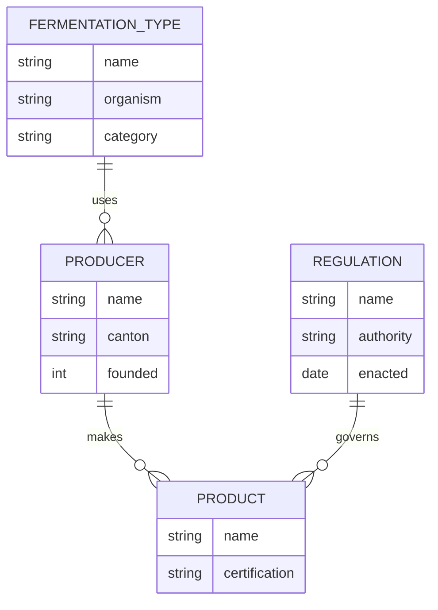

# The Axolotl Summer Internship

## A Guide for Prospective Interns

---

### A Different Kind of Internship

Most internships give you tasks. They hand you a list of things to do, a set of tools someone else chose, and a manager who checks whether you did them. You learn something, sure — but mostly you learn how to execute someone else's plan.

This is not that internship.

The Axolotl Summer Internship is built around a simple but radical idea: that the most valuable thing a beginner can offer is not their productivity, but their *perspective*. When you are new to a domain, you see things that experts have learned to ignore. You ask questions that nobody thinks to ask anymore. You notice patterns that have become invisible through familiarity. And in the summer of 2026, you have access to AI tools that can amplify that beginner's perspective in ways that were impossible even two years ago.

Your job this summer is not to produce widgets. It is to learn how to learn, using AI as your research partner, and to build a framework for understanding a domain that genuinely fascinates you. By the end of eight weeks, you will have a GitHub repository that can survive a Socratic interrogation on your chosen topic. You will have developed real literacy with AI coding and research tools. And you will have done it in collaboration with a team of research professionals who are invested in your growth, not just your output.

This document is a detailed guide to what that looks like in practice — the philosophy, the tools, the cadence, the people, and what we expect from you (and what you should expect from us).

---

### The Philosophy: Learning First, Always

Every decision in this program flows from a single principle: **the primary measure of success is what you walk away with, not what you produce.** This is not a rhetorical flourish — it has concrete consequences for how the internship operates.

First, it means we measure differently. We do not count your artifacts. We do not compare you to other interns. We do not grade your output. The question we ask at the end is simple: *do you feel like you gained valuable, durable skills that you can articulate and demonstrate?* If the answer is yes, the internship was a success — regardless of whether your repository has seven artifacts or seventy.

Second, it means we have designed the program around *engagement* rather than *efficiency*. Before the internship even begins, you will spend ten to twenty hours in conversation with the Axolotl team, exploring potential research domains. We do this because the single most important predictor of success is whether you genuinely care about what you are studying. AI tools are powerful, but they cannot manufacture curiosity. A topic that fascinates you will pull you through the hard parts. A topic that bores you will make every hour feel like a chore. So we work with you to find the intersection of what interests you and what has economic value to Axolotl Partners. The domains for Summer 2026 — fermented food systems and asset tokenization — were chosen this way: co-selected with the interns through patient, exploratory conversation.

Third, it means we embrace struggle. Learning something genuinely new is hard. It is supposed to be hard. The cognitive friction you feel when an AI tool contradicts itself, when a concept refuses to click, when a research path dead-ends — that friction is not a sign that something is wrong. It is the mechanism by which skills get written into your neurons. We want you to struggle productively. We do not want you to get stuck in unproductive frustration. There is a difference, and part of what you will learn this summer is how to tell the difference — and what to do about it. The WhatsApp group chat with the entire Axolotl team serves as your release valve. When productive struggle tips into real frustration, you reach out. Someone will respond promptly.

---

### The Tools: Your AI Research Stack

You will be given accounts on five platforms. These are not just "tools to use" — they are surfaces through which you will conduct research, build artifacts, coordinate with the team, and develop AI literacy. Understanding each surface's purpose is part of the learning.

**GitHub** is your ground truth. Every artifact you produce — markdown documents, code files, CSV datasets, JSON exports, agent skills, PDF reports — lives in a repository under the Axolotl-Research organization. GitHub is where your work is version-controlled and where the research professionals will review your artifacts. It is the persistence surface: if it is not on GitHub, it does not exist. Public repositories mean your work is visible, which is both an accountability mechanism and a portfolio asset for you after the program ends.

**Cline** is your primary AI coding and research agent. For Summer 2026, both interns have chosen to start with Cline as their first tool. Cline lives inside your development environment and can help you write code, research topics, structure documents, build databases, and iterate on ideas. It is the engine of your research cycles. You will learn how to prompt it effectively, how to evaluate its outputs (it is probabilistic, not deterministic — it will sometimes be wrong, and learning to recognize when is a core skill), and how to use it as a thinking partner rather than an answer machine.

**KiloCode** and **Zed Agent** are additional AI surfaces you will adopt as your needs evolve. They overlap with Cline in functionality, and that overlap is not a bug — it is a learning opportunity. When two AI tools give you different answers to the same question, you are forced to evaluate, compare, and exercise judgment. You learn that these are not deterministic systems and that you, the human, are the ultimate arbiter of quality. There is no tool-authority hierarchy. You develop the discernment to navigate disagreement, and that discernment is one of the most valuable AI literacy skills you will acquire.

**WhatsApp** is your coordination surface. The Axolotl Interns group chat includes every research professional on the team — Matt, Mike, Ivan, and Mario — and serves three purposes: status check-ins, help requests, and general team conversation. We use WhatsApp because the Axolotl team already lives there, which means zero adoption friction and genuinely prompt responses. Critical curation decisions are captured in GitHub review comments, not in WhatsApp, so the chat is free to be lightweight and conversational.

---

### The Research: Entities, Relationships, and Time

Your core intellectual task this summer is to develop a *framework* for understanding your chosen domain. We use the word "framework" deliberately — it is not a literature review, a summary, or a collection of facts. A framework is a structured way of seeing that captures what exists in the domain, how those things relate to each other, and how both are changing over time.

Here is the simplest way to think about it: **your job is to collect entities, then map relationships, then trace change.**

#### First Half (Weeks 1-4): Collect Entities

An *entity* is anything that exists in your domain — a thing you can name, describe, and put in a box on a diagram. For fermented food, entities include fermentation types (lacto-fermentation, acetic acid fermentation, alcoholic fermentation), organisms (Lactobacillus, Saccharomyces), producers (Gustav Gerig, Fabas), Swiss research institutions (Agroscope, ETH Zürich), regulations (Swiss Food Safety Act), and products (Bürli, Molke, sauerkraut). For asset tokenization, entities include token standards (ERC-20, ERC-721, ERC-1155), blockchain platforms (Ethereum, Solana), regulatory bodies (SEC, FINMA), DeFi protocols (Uniswap, Aave), and legal concepts (security token, utility token).

Your first four weeks are about finding, describing, and understanding these entities. Each artifact you produce — a markdown file about a producer, a CSV of Swiss fermentation companies, a code snippet demonstrating an ERC-20 deployment — is an entity in your collection. You are building your domain's *lexicon*: the dictionary of terms that have specific meaning in your domain. In the context of AI tools, these words are not just labels — they are tools, actions, and maps. When you prompt Cline with the right term, you unlock a new layer of the domain. Building your lexicon is building your ability to navigate.

#### Second Half (Weeks 5-8): Map Relationships

A *relationship* is how two entities connect. Agroscope *researches* lacto-fermentation. ERC-721 *enables* digital ownership. Gustav Gerig *produces* Bürli. FINMA *regulates* security tokens. Relationships are where the meaning lives — a list of entities is just a catalog; a map of relationships is a framework.

Your primary tool for mapping relationships is the **mermaid entity-relationship diagram**. Mermaid is a simple text language for drawing diagrams. You write a few lines describing your entities and their connections, and it renders as a visual map. Because it is text, it version-controls cleanly in Git. Because it is visual, your research professionals can see your framework at a glance. A mermaid ER diagram in your repository's README is the single clearest signal that you have moved from collecting facts to understanding structure.

Here is what a simple domain ER diagram looks like:

#### The Third Dimension: Time

Neither entities nor relationships are static. The third dimension of your framework is temporal analysis — understanding how both are changing. AI is automating complex syntactical work (writing smart contracts, optimizing fermentation parameters, analyzing regulatory documents), and in doing so, it is providing tools for evolving and reframing the semantics as well. Your framework must account for this dynamism. How are the entities in your domain changing? How are the relationships shifting? What role is AI playing in both transformations? A framework that only captures the present moment is already out of date. A framework that traces the vectors of change is genuinely useful.

This entity-relationship-temporal structure is not an academic exercise. It is the architecture of your deliverable. By Week 8, your repository should contain enough depth across all three dimensions that a domain expert can interrogate you on any of them and you can respond with substance. **Once you have the entities and their relationships — and you understand how they are changing — you have your framework.**

---

### The Cadence: Eight Weeks, Step by Step

The program runs eight weeks at twenty hours per week, with an optional three-week extension buffer. Here is what each phase looks like.

#### Week 1: Onboarding

Your accounts are provisioned. You have access to GitHub, Cline, KiloCode, Zed Agent, and the WhatsApp group.

**Your first task:** pick one of two starting points and begin.

- **Path A — Start with GitHub:** Go to github.com, sign in, and create a new repository in the Axolotl-Research organization. Clone it to your computer. Create a `README.md` file describing your domain and what you hope to learn. Commit and push it. Congratulations — you have made your first artifact.

- **Path B — Start with Cline:** Open Cline in your editor and type: "I'm researching [your domain]. Help me identify the 10 most important entities in this field." See what it produces. Ask follow-up questions. Save the conversation as a markdown file. That is your first artifact.

Whichever path you start with, do the other one soon after. Your first twenty hours are about getting comfortable with GitHub basics (clone, branch, commit, push) and Cline basics (prompting, iterating, evaluating outputs). You are not expected to learn all four AI tools in the first week — that would be overwhelming and counterproductive. By Friday, you should have a working repository with at least one artifact, an introduction posted in the WhatsApp group, and the beginnings of your domain lexicon — the vocabulary of key terms that will grow throughout the program.

Skim the [`AI_RESEARCH_LITERACY.md`](AI_RESEARCH_LITERACY.md) dictionary. Do not try to memorize it. Notice what you recognize and what you do not. Return to it as concepts surface in your work. Read the [`YOUNG_RESEARCHER_GUIDE.md`](YOUNG_RESEARCHER_GUIDE.md) for practical advice on researching with probabilistic tools.

#### Week 2: Learn

Now you begin the real work. You conduct initial research prompts, exploring your domain broadly before narrowing. Your goal is entity collection — identifying and describing the things that exist in your domain. You produce your first three artifacts and commit them. Your first curation review is completed. You are learning what good AI prompting feels like and what bad prompting produces. You are discovering the boundaries of your domain, the key institutions, the major debates, the canonical sources. You are also encountering the first moments of productive struggle — the AI hallucinates a Swiss food regulation that does not exist, or confidently explains a token standard that was deprecated three years ago. You learn to verify. You learn to push back. You learn that the AI is a partner, not an oracle.

#### Weeks 3-4: Research-I — Deep Entity Collection

This is the deep dive on entities. You are accumulating artifacts at your own pace, driven by your own curiosity. You have at least five artifacts in your repository. Your lexicon is growing. The twice-weekly batch curation cycle is now running: every three to four days, a research professional reviews your latest work and provides feedback via GitHub review comments — Merge (accepted as-is), Revise (returned with specific, actionable feedback), Defer (hold for later, when dependencies are met), or Discard (out of scope or superseded). You are learning to receive feedback, to incorporate it, and to keep producing during the three-to-four-day gap between batch reviews. The research cycle — prompt, synthesize, document, commit, curate — is becoming second nature.

**By the end of Week 4, you should have a solid entity catalog.** Your GitHub review history should show a pattern: early Revise decisions gradually shifting toward Merge as your entity descriptions become more accurate and complete.

#### Weeks 4-5: Curation-I — The Inflection Point

By now, every artifact from the first three weeks has passed through at least one curation cycle. The research professionals have identified gaps in your entity collection. Maybe your producer list is thorough but your organism taxonomy is thin. Maybe your token standards are well-documented but the regulatory entities are missing. This is the inflection point: you now have a curated map of what you know and what you do not know. The second half of the program shifts from entity collection to relationship mapping.

#### Weeks 5-6: Research-II — Relationship Mapping

Armed with specific, actionable curation feedback, you return to research — but with a different focus. You are no longer just collecting entities; you are discovering how they connect. You build code artifacts that demonstrate relationships in action (a token deployment script, a fermentation data pipeline). You create databases (exported as CSV or JSON, never binary blobs, with schema documentation) that encode entity-relationship structures. You write analysis that traces connections between your cataloged entities. And you begin drawing **mermaid ER diagrams** — first rough drafts, then increasingly refined maps — that make your framework visible.

#### Weeks 6-7: Synthesis — The Framework Takes Shape

This is where the framework comes together. You are no longer producing standalone artifacts — you are integrating them. The capstone deliverable takes shape: a report, a program, a website, or a hybrid that demonstrates your domain framework in action. Your mermaid ER diagrams are now central to your repository — they show the entity-relationship structure that makes your collection a framework rather than a catalog. Cross-references between artifacts are meaningful, not perfunctory. You begin testing your own work: can you explain your domain framework to someone who has not been on this journey with you? Can you look at your ER diagram and trace any relationship Ivan might ask about?

#### Weeks 7-8: Polish

Final curation passes. Deliverable refinement. A self-administered grill-me test: you find, load, and use the **grill-me skill** (created by Matt Peacock and used in KiloCode's Architect Agent) to interrogate your own framework. Where do you stumble? Where can the AI ask five levels deep and you still have answers? You shore up the weak points. The repository is clean, organized, and complete. The ER diagrams are clear. Your GitHub review history tells the story of your intellectual development. You are ready.

#### Week 8: Close

Final review with the research professionals. Accounts are reviewed for offboarding. You discuss what comes next — a consulting follow-up to extend the work, a reference letter, a portfolio piece. You walk away.

#### Weeks 9-11: Buffer

Life happens. Summer internships are not immune to the ordinary interruptions of life — family events, health issues, unexpected obligations. If you need to pause, you pause. The program extends by up to three weeks, no questions asked, no penalties applied. Matt manages the extension decision in consultation with you and the research professionals. The buffer is built into the calendar because we expect it to be used.

---

### The Team: Four Research Professionals, Four Roles

You are not doing this alone. The Axolotl Partners research team has four members, each with a distinct role in supporting your work.

**Ivan** is the domain anchor. His expertise spans fermented food systems, software architecture, and cryptocurrencies — which means he covers both Summer 2026 domains directly. When Ivan reviews your artifacts, he is evaluating domain accuracy: are your entities correctly identified and described? Are your relationships accurately mapped? Does your temporal analysis hold up? Ivan's curation decisions carry the most weight on substance.

**Mario** is the AI methodology expert. His domain is AI research agents — the very tools you are learning to use. When Mario reviews your work, he is looking at *how* you are using the tools, not just *what* you are producing. Are your prompts effective? Are you evaluating AI outputs critically? Are you developing discernment about when to trust and when to verify? Have you discovered and used agent skills? Mario ensures you are building genuine AI literacy, not just producing artifacts.

**Matt** is the program manager and business context expert. He manages the overall program, ensures response times from the team, and reviews curation patterns for program-level quality. Matt also provides the business lens: does your research connect to something economically valuable? Is your framework useful beyond the academic exercise?

**Mike** is the team navigator. His primary domain is biotechnology, which is not directly relevant to either Summer 2026 topic — but that is not his role here. Mike knows how to work well with the different quirks of each Axolotl team member, and his job is to help you navigate any confusion or communication issues that arise. If feedback from a research professional becomes superficial or unhelpful, Mike intervenes. If you are struggling to get a response, Mike unblocks. He is the human glue that keeps the collaboration healthy.

All four are available on demand in the WhatsApp group. Matt ensures that someone responds promptly. This is not a hierarchical relationship — it is a collaboration between you, the beginner with fresh eyes, and them, the experts who want to see what you see.

---

### The Deliverable: A Repository That Can Survive Interrogation

Your capstone deliverable is a GitHub repository containing an artifact — or combination of artifacts — that puts your domain framework to work. The format is flexible:

- A **markdown report** with entity-relationship analysis, mermaid ER diagrams, and links to supporting documents and source materials
- A **program** with an install script that demonstrates domain relationships in action (a token deployment on a testnet, a fermentation data pipeline, an interactive visualization)
- A **website** that presents your framework — entities, relationships, and temporal change — in an accessible, interactive form
- A **hybrid** combining any of the above

The format is not what matters. What matters is the depth.

The quality bar is this: your repository must be able to **survive a grill-me interrogation**. "Grill-me" is a Socratic examination protocol — a special kind of AI agent skill created by Matt Peacock and used in KiloCode's Architect Agent — that probes understanding through escalating levels of difficulty:

1. **Recall & Definition**: What is X? Define Y. What does acronym Z stand for?
2. **Mechanism & Causation**: How does X actually work? Walk me through the flow from A to B.
3. **Rationale & Tradeoffs**: Why was it designed this way? What are the tradeoffs? What would break if we removed component Z?
4. **Edge Cases & Failure Modes**: What happens when X fails? How does the system behave under unanticipated conditions?
5. **Synthesis & Novel Scenarios**: Given a new requirement, how would you extend the architecture? If you had to redesign this from scratch, what would you change?

**Finding, loading, and using the grill-me skill is part of your learning journey.** One of your key assignments this summer is to discover agent skills by tracking down grill-me and using it to test your framework. If a domain expert (or the grill-me skill itself) can ask you questions at all five levels and you can respond with substance, your deliverable meets the bar. This is not about memorization — it is about genuine understanding. You cannot bluff your way through a grill-me. The questions are designed to find the boundary between what you truly know and what you merely recognize.

This quality bar is intentionally high. It is also achievable. Eight weeks of focused, AI-enabled research, with twice-weekly curation from domain experts, is enough to build real depth. And the grill-me standard ensures that what you produce is not just a collection of artifacts but a framework you can defend, extend, and apply after the program ends.

---

### The Practical Details

**Hours:** Twenty hours per week. How you distribute those hours is up to you — mornings, afternoons, split across days, concentrated in bursts. The only requirement is that you maintain the weekly cadence and respond to curation within the three-to-four-day batch window.

**Location:** Remote. You work where you work best. The tools are cloud-based or local. The team communicates asynchronously through WhatsApp and GitHub.

**Extension:** Up to three weeks of buffer beyond the eight-week program. Life happens. We plan for it.

**Compensation:** This is a learning-first program. You are paid in skills, mentorship, a portfolio piece, and a relationship with a research team that may lead to consulting follow-ups. The value proposition is what you walk away with — AI literacy, domain expertise, and a demonstrable framework you built yourself.

**Account Lifecycle:** Your tool accounts are provisioned before Week 1. At program close, GitHub access may be maintained for consulting follow-ups. AI tool accounts are handled based on licensing and account type. You will know the offboarding plan before it happens.

**Getting stuck?** Check the [`FAQ.md`](FAQ.md) for common Week 1 problems. If you are still stuck after trying the solutions there, WhatsApp the group. That is what it is for.

---

### What You Will Walk Away With

If the internship succeeds — and it succeeds when you are engaged, curious, and willing to struggle productively — here is what you will have at the end of eight weeks:

**AI literacy.** Not just "I used ChatGPT a few times." You will understand Git and GitHub workflows. You will know how to prompt LLMs effectively and evaluate their outputs critically. You will have hands-on experience with the model ecosystem, MCP tools, agent skills (including grill-me), and agent-to-agent protocols like ACP and A2A. You will understand the difference between deterministic and probabilistic compute, and you will have developed the discernment to know which kind of problem belongs to which kind of tool. You will be able to draw entity-relationship diagrams to map and communicate complex domains. You will have seen firsthand how AI is reshaping workflows — because you will have used it to reshape your own.

**Domain expertise.** You will be able to have a substantive conversation about fermented food production systems or asset tokenization with someone who works in the field. Not at the expert level — eight weeks will not make you Ivan — but at a level of genuine understanding. You will know the entities: what exists in the domain. You will know the relationships: how those entities connect. And you will know the temporal dimension: how both are changing, and what role AI is playing in that change.

**A portfolio piece.** Your GitHub repository is public. It is version-controlled. It has mermaid ER diagrams that show your framework at a glance. It has a review history showing expert feedback and your responses. It demonstrates not just what you know but how you learned it. For a prospective employer, that is more compelling than a GPA or a line on a résumé.

**A relationship with a research team.** The Axolotl Partners team will know your work, your thinking, and your potential. Post-program consulting follow-ups are an explicit part of the model. This is not a one-way mentorship — it is the beginning of a professional relationship.

**The ability to learn anything with AI.** This is the meta-skill that underlies everything else. The framework you build for your domain — entity collection, relationship mapping, temporal analysis, iterative AI-enabled research, expert-guided curation — is a repeatable methodology. After this summer, you will know how to take an unfamiliar domain and, within weeks, build a structured understanding deep enough to survive expert interrogation. That skill transfers to any field, any career, any intellectual challenge you pursue.

---

### A Final Word

This internship is not for everyone. If you want clear instructions, well-defined tasks, and a manager who tells you exactly what to do, there are better programs for you. This program asks you to drive your own learning, to sit with uncertainty, to struggle productively, and to produce work that can withstand genuine scrutiny.

But if you are curious about a domain that genuinely fascinates you, if you want to learn how to learn with AI as your research partner, and if you are willing to be both student and researcher in equal measure — this summer will change how you think about what you are capable of.

We are looking forward to working with you.
