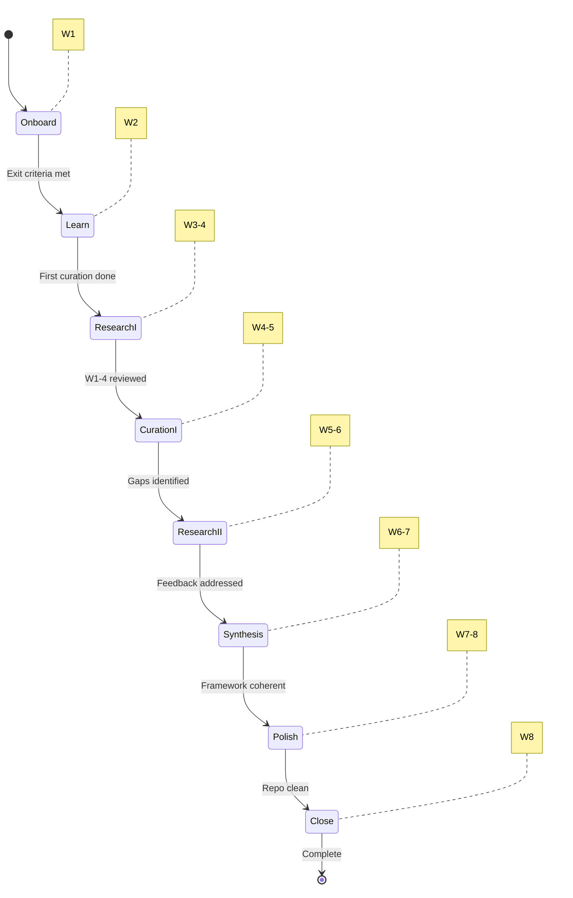
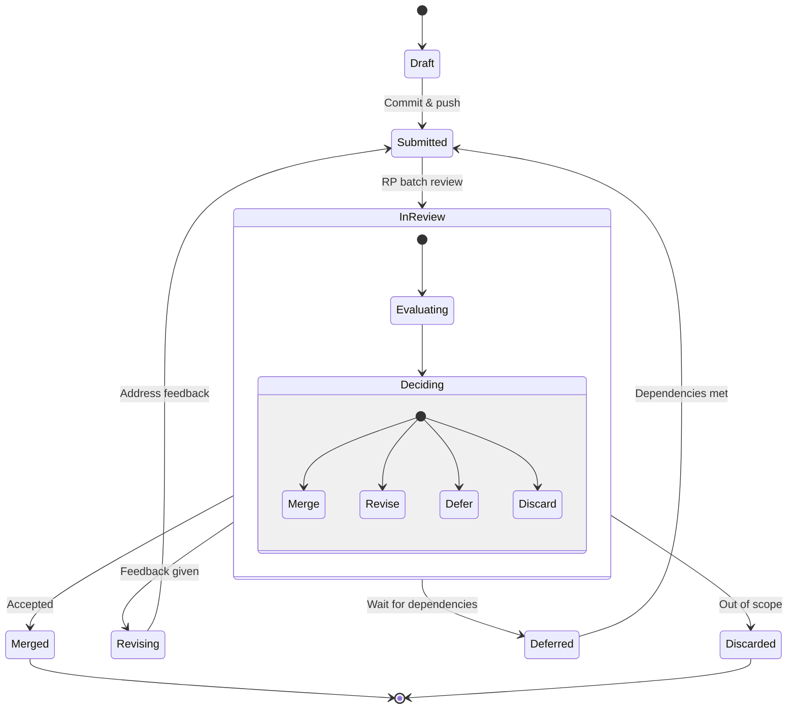

# Axolotl Summer Internship Program

**Program:** 8-week AI-enabled research internship (Summer 2026)
**Capacity:** 1-3 interns (hard-capped at Axolotl team size minus one)
**Schedule:** 20 hours/week over 8 weeks + 3-week buffer

---

  

---

## Documents

### Program Specification

| Document | Purpose | Audience |
|----------|---------|----------|
| [`INTERNSHIP_SPECIFICATION.md`](INTERNSHIP_SPECIFICATION.md) | **Full program specification** — DDMVSS 9-category framework applied to the internship | Interns, Research Professionals, Axolotl Partners |
| [`WRITING_EXCELLENCE.md`](WRITING_EXCELLENCE.md) | **Writing Excellence Protocol** — the four tests (Hopper, Lovelace, Schriver, Gentle) for documentation quality; adapted for internship artifacts | Interns (quality standard for all artifacts) |

### Onboarding & Getting Started

| Document | Purpose | Audience |
|----------|---------|----------|
| [`PROSPECTIVE_INTERN_GUIDE.md`](PROSPECTIVE_INTERN_GUIDE.md) | **What to expect** — verbose guide: philosophy, tools, entity-relationship research framework, 8-week cadence, team, outcomes | Prospective interns; read first |
| [`TOOL_QUICKSTART.md`](TOOL_QUICKSTART.md) | **Tool quickstart** — bare-minimum getting-started for GitHub, Cline, Zed, and KiloCode | Interns (Week 1) |
| [`AI_RESEARCH_LITERACY.md`](AI_RESEARCH_LITERACY.md) | **AI literacy dictionary** — 8 literacy areas with definitions, tiered links (beginner/intermediate/advanced), and a preamble on how to use it | Interns (skim Day 1, reference throughout) |
| [`YOUNG_RESEARCHER_GUIDE.md`](YOUNG_RESEARCHER_GUIDE.md) | **Young researcher's guide** — how to think about researching with probabilistic, evolving AI tools; entity-relationship methodology | Interns (read before Week 1, return to often) |
| [`FAQ.md`](FAQ.md) | **Frequently asked questions** — common Week 1 problems (GitHub, Cline, communication, ER diagrams) with solutions and escalation guidance | Interns (reference when stuck) |
| [`PROMPT_CHEAT_SHEET.md`](PROMPT_CHEAT_SHEET.md) | **Prompting cheat sheet** — quick-reference card with prompts for every phase: entity collection, relationship mapping, ER diagrams, self-curation, grill-me, verification, format control | Interns (print it, keep it open) |
| [`AI_ALPHABET_SOUP.md`](AI_ALPHABET_SOUP.md) | **AI Alphabet Soup** — demystifying MCP, ACP, A2A, LLM, API; why everything is just programs sending messages; how to spot jargon that obfuscates vs. enables | Interns (read when drowning in acronyms) |
| [`CURATED_LINKS.md`](CURATED_LINKS.md) | **Curated resource links** — standalone collection of best free resources across all literacy areas, Swiss-specific links, domain-specific links, YouTube tutorials | Interns (launchpad for learning) |
| [`ONBOARDING_CHECKLIST.md`](ONBOARDING_CHECKLIST.md) | **Onboarding checklist** — Day-by-Day Week 1 checklist with exit criteria, orientation reading, and self-check | Interns (Week 1) |

### Mid-Program Analysis (Week 4)

| Document | Purpose | Audience |
|----------|---------|----------|
| [`ANALYSIS_INTERN_A.md`](ANALYSIS_INTERN_A.md) | **Mid-program analysis — Intern A** — four-methodology convergence analysis for the probiotic lifecycle case study; scope decisions, argument choices, Week 4-8 roadmap | Intern A (read at Week 4) |
| [`ANALYSIS_INTERN_B.md`](ANALYSIS_INTERN_B.md) | **Mid-program analysis — Intern B** — four-methodology convergence analysis for the tokenization vs. securitization case study; framing choices, comparison dimension audit, Week 4-8 roadmap | Intern B (read at Week 4) |

### Reading Library

| Folder | Internship Mapping | Key Resources |
|--------|--------------------|-------------|
| [`Library/`](Library/) | **Curated reading library** — books and papers mapped to internship domains and competency areas | Interns (reference throughout program) |
| [`Library/INDEX.md`](Library/INDEX.md) | **Library index** — every file with its relevance to the internship specification | Interns, Research Professionals |
| [`Library/Domain-A-Food-Systems/`](Library/Domain-A-Food-Systems/) | Domain A: Fermented foods, microbes, nutrients & human health | Domain A interns |
| [`Library/Domain-B-Tokenization/`](Library/Domain-B-Tokenization/) | Domain B: Real-world asset (RWA) tokenization | Domain B interns |
| [`Library/Complexity-Systems-Thinking/`](Library/Complexity-Systems-Thinking/) | Cross-cutting: ER modeling, semantic spaces, emergent behavior; includes probabilistic thinking | All interns |
| [`Library/Research-Methodology/`](Library/Research-Methodology/) | Research cycle, verification, forecasting, valuation, problem-solving | All interns |
| [`Library/MAIA-Substack/`](Library/MAIA-Substack/) | Curated Substack readings + MA Guidebook | All interns |

### Agent Skills

| Resource | Purpose | Audience |
|----------|---------|----------|
| [`Skills/README.md`](Skills/README.md) | **Skills user guide** — what each of 16 agent skills does, when to use them, and how they progress through the 8-week program | Interns (reference throughout) |
| `Skills/*/SKILL.md` | Individual skill definitions — feed to Cline, KiloCode, or Zed Agent as context | Interns (activate as needed) |

---

## Core Axioms

1. **Learning-first, not output-first.** Artifacts are vehicles for skill acquisition. The intern walking away with new capabilities is the primary metric of success.
2. **Engagement over cross-pollination.** Each intern works a domain they are genuinely passionate about, co-selected through 10-20 hours of pre-program discussion.
3. **Struggle is productive.** Learning new things is hard. The program encourages productive struggle while providing a release valve (WhatsApp group) before frustration sets in.
4. **The intern is the documentation.** Artifacts may not be fully self-documenting; the intern carries the context. Post-program consulting follow-ups are expected and welcomed.

---

## Program at a Glance

The internship follows an 8-week phase-driven lifecycle with built-in buffer for interruptions.

Full phase map with entry/exit criteria: [`docs/diagrams/state-program-phases.md`](../docs/diagrams/state-program-phases.md)

---

## Tool Surfaces

| Tool | Purpose | Account |
|------|---------|---------|
| **GitHub** (Axolotl-Research org) | Artifact storage, version control, curation | Organization member |
| **Cline** (cline bot) | AI-assisted coding and research | Individual account |
| **KiloCode** (kilo.ai) | AI-assisted coding | Individual account |
| **Zed Agent** (zed.dev) | AI-assisted editing | Individual account |
| **WhatsApp** (Axolotl Interns group) | Coordination, check-ins, release valve | Group chat member |

---

## Research Professionals

| Name | Role | Covers |
|------|------|--------|
| **Ivan** | Domain expert | Fermented food, software architecture, cryptocurrencies |
| **Mario** | AI methodology expert | AI research agents, tool usage effectiveness |
| **Matt** | Program manager | Business context, program quality, response SLA |
| **Mike** | Team navigator | Communication health, RP engagement, conflict resolution |

---

## Summer 2026 Domains

| Intern | Domain | Syntax Focus | Semantics Focus | Narrative |
|--------|--------|-------------|-----------------|
| Intern A | Fermented Foods, Microbes, Nutrients & Human Health | Fermentation microbiology, metabolic pathways, nutrient transformations | Microbial ecology of fermented foods, nutrient-health pathway mapping, Swiss food ecosystem, food safety frameworks | **Imaginary business case study** — designing a family of probiotic lifecycle products for a Swiss food & cosmetics startup: colicky babies, athletes, C. diff recovery, skin health |
| Intern B | Real-World Asset (RWA) Tokenization | Token standards (ERC-20/721/1155), smart contracts, blockchain infrastructure | Asset valuation frameworks, regulatory models for tokenized RWAs, market structures, custody & ownership models | **Imaginary business case study** — how tokenization displaces traditional securitization for small real estate developers: lower cost, low-doc investment groups with automated investor payments |

---

## Quality Bar

The capstone deliverable for Summer 2026 is an **imaginary business case study** — a narrative-driven exploration of the domain through a fictional company, product, or intervention. The case study must survive **grill-me interrogation** — a Socratic examination that probes the domain from Level 1 (Recall) through Level 5 (Synthesis & Novel Scenarios). If the intern can defend their work through this questioning, the deliverable meets the bar. The fictional framing is a storytelling vehicle; every domain claim within it must be grounded in researched entities and relationships.

**Building a case study — key insights from the mid-program analysis:**

Building a defensible case study in 8 weeks requires navigating three tensions:

1. **Breadth vs. depth.** The entity-collection phase (Weeks 1-4) is expansive by design — you cast a wide net. The convergence phase (Weeks 4-8) demands hard scope decisions. The case studies that survive grill-me are the ones that go deep on fewer dimensions rather than shallow on many. The `ANALYSIS_INTERN_*.md` documents help you make these scope decisions at the Week 4 inflection point.

2. **Advocacy vs. honesty.** A case study can argue a thesis ("tokenization IS the future") or compare honestly ("here are two models, each with tradeoffs"). The grill-me is harder on advocacy than on honest comparison. The strongest case studies acknowledge limitations explicitly — what's scoped out, what's uncertain, what evidence is thin.

3. **Narrative vs. evidence.** The fictional framing (company, characters, decision points) makes the case study engaging — but every domain claim in the story must be backed by researched entities and relationships. The fiction is in the characters and scenario, not in how fermentation works or how ERC-3643 tokens are deployed.

These tensions were surfaced by applying four analytical methodologies (grill-me, essentialist, hypothesis-framer, superforecasting) to each case study framing. The resulting analysis documents map the question landscape, surface the hard choices, and provide calibrated probability estimates for different scope decisions — all designed to help you ASK better questions, not to give you answers.

**How grill-me works:** The grill-me skill (defined in `~/.agents/skills/grill-me/SKILL.md`) conducts an oral examination in rounds. Each round asks 2-3 questions at escalating difficulty:

| Level | What It Tests | Example Question |
|-------|---------------|-----------------|
| **1. Recall** | Can you define the term? | "What is lacto-fermentation?" |
| **2. Mechanism** | Can you explain how it works? | "How does Lactobacillus convert sugars to lactic acid?" |
| **3. Rationale** | Can you explain why it is designed this way? | "Why do Swiss producers use mixed-strain cultures instead of single strains?" |
| **4. Edge Cases** | What happens when it breaks? | "What happens when the pH drops below the organism's tolerance during fermentation?" |
| **5. Synthesis** | Can you extend or redesign it? | "If you had to design a monitoring system for small-scale Swiss fermenters, what would it look like?" |

The grill-me skill tracks your performance across areas and gives a summary assessment with specific recommendations for what to study next. **Finding, loading, and using the grill-me skill is part of your learning journey** — one of your key assignments is to discover it and use it to test your framework.

See also:
- [`WRITING_EXCELLENCE.md`](WRITING_EXCELLENCE.md) — how the four writing tests (Hopper, Lovelace, Schriver, Gentle) connect to grill-me levels
- [`PROSPECTIVE_INTERN_GUIDE.md`](PROSPECTIVE_INTERN_GUIDE.md) §"The Deliverable" — detailed explanation of the grill-me standard
- `~/.agents/skills/grill-me/SKILL.md` — the full skill definition

---

## Artifact Lifecycle

Every artifact follows this curation pipeline. Research professionals make Merge/Revise/Defer/Discard decisions during twice-weekly batch reviews.

Full lifecycle with guard conditions: [`docs/diagrams/state-artifact-lifecycle.md`](../docs/diagrams/state-artifact-lifecycle.md)

---

## Quick Start — Week 1 (Onboarding)

For a detailed Day 1-5 walkthrough, see [`ONBOARDING_CHECKLIST.md`](ONBOARDING_CHECKLIST.md).

1. [ ] All tool accounts provisioned and accessible
2. [ ] GitHub repository created in Axolotl-Research org
3. [ ] First Cline research session completed
4. [ ] First artifact committed and pushed
5. [ ] WhatsApp introduction posted in Axolotl Interns group
6. [ ] Domain lexicon draft started

---

## Diagrams

Detailed program and process diagrams are in [`docs/diagrams/`](../docs/diagrams/):

| Diagram | What It Shows |
|---------|--------------|
| [`Program Architecture`](../docs/diagrams/flowchart-program-architecture.md) | How interns, RPs, domains, tools, and documents connect |
| [`Document Navigation`](../docs/diagrams/flowchart-document-navigation.md) | Decision tree: which document to read when |
| [`Library Structure`](../docs/diagrams/flowchart-library-structure.md) | Simplified reading library: 5 folders, 110 files, domain mapping |
| [`Artifact Lifecycle`](../docs/diagrams/state-artifact-lifecycle.md) | How artifacts move through curation pipeline |
| [`Program Phases`](../docs/diagrams/state-program-phases.md) | 8-week phase transitions with entry/exit criteria |

