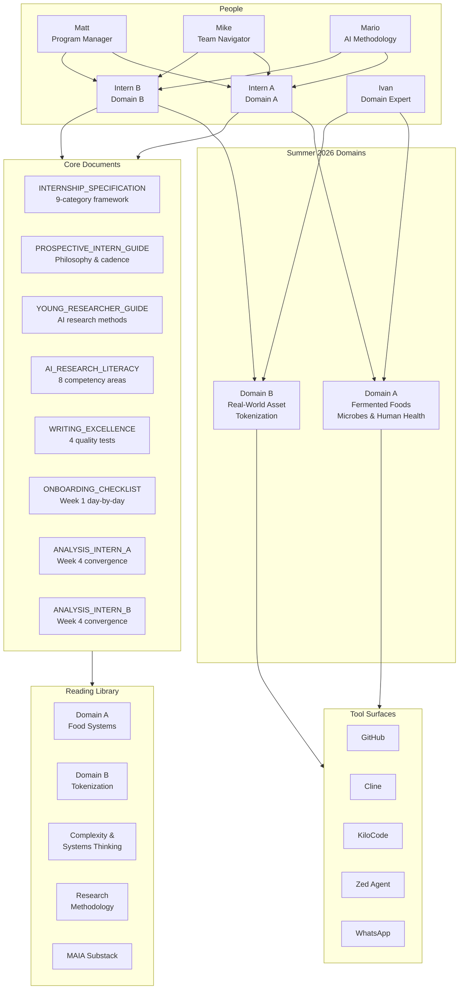
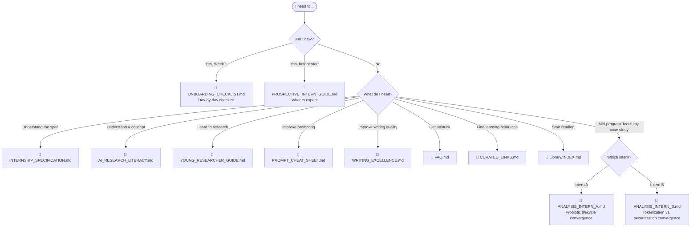
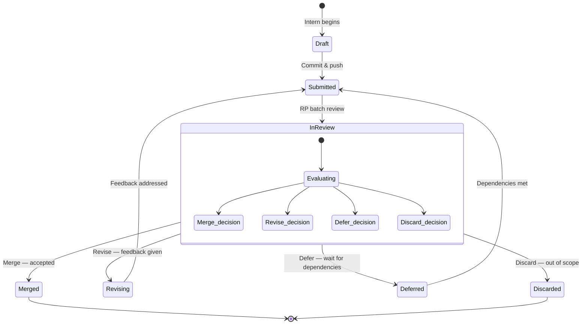
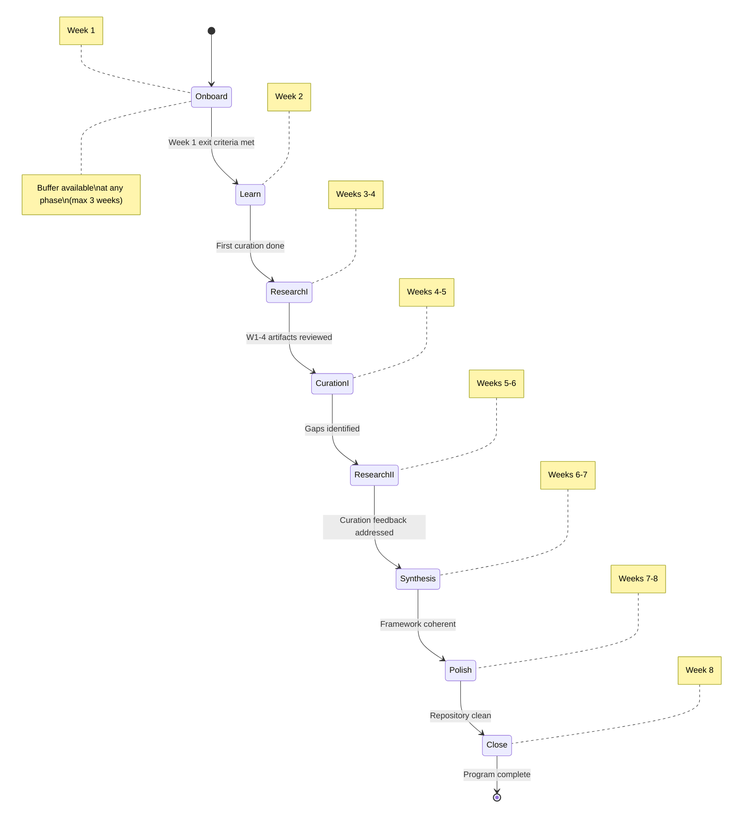

# AI_Tools

<div align="center">
  
</div>

Axolotl Partners — tools, specifications, and resources for AI-enabled research.

## Internal Analysis Reports

Mid-program (Week 4) convergence analyses providing scope decisions, argument choices, and Week 4–8 roadmaps for each intern:

- **[`Internship/ANALYSIS_INTERN_A.md`](Internship/ANALYSIS_INTERN_A.md)** — Fermented foods, microbes & human health: probiotic lifecycle case study, four-methodology convergence
- **[`Internship/ANALYSIS_INTERN_B.md`](Internship/ANALYSIS_INTERN_B.md)** — RWA tokenization: tokenization vs. securitization case study, framing comparison

---

## What Is This Repository

This repository holds the program materials, reading library, and supporting documents for the Axolotl Summer 2026 Internship Program — an 8-week AI-enabled research internship where interns build domain frameworks using Cline, KiloCode, and Zed Agent as research partners.

See the architecture diagram below for how all components fit together. If you are a new intern, go directly to the [document navigation map](#document-navigation).

---

## Program Architecture



---

## Repository Structure

```
AI_Tools/
├── README.md                                    ← You are here
├── docs/
│   └── diagrams/                                ← Program & process diagrams
│       ├── flowchart-program-architecture.md
│       ├── flowchart-document-navigation.md
│       ├── flowchart-library-structure.md
│       ├── state-artifact-lifecycle.md
│       └── state-program-phases.md
└── Internship/
    ├── README.md                                ← Program portal — start here
    ├── INTERNSHIP_SPECIFICATION.md              ← Full DDMVSS specification (9/9 categories)
    ├── PROSPECTIVE_INTERN_GUIDE.md              ← What to expect — philosophy, tools, framework, cadence
    ├── ONBOARDING_CHECKLIST.md                  ← Day-by-day Week 1 checklist
    ├── YOUNG_RESEARCHER_GUIDE.md                ← How to research with probabilistic AI tools
    ├── AI_RESEARCH_LITERACY.md                  ← Dictionary of 8 AI literacy competency areas
    ├── AI_ALPHABET_SOUP.md                      ← Demystifying MCP, ACP, A2A, LLM, and other jargon
    ├── PROMPT_CHEAT_SHEET.md                    ← Quick-reference prompting card for every phase
    ├── CURATED_LINKS.md                         ← Best free resources across all literacy areas
    ├── TOOL_QUICKSTART.md                       ← Bare-minimum getting-started for GitHub, Cline, Zed, KiloCode
    ├── FAQ.md                                   ← Common problems with solutions
    ├── WRITING_EXCELLENCE.md                    ← Four writing tests (Hopper, Lovelace, Schriver, Gentle)
    ├── ANALYSIS_INTERN_A.md                     ← Mid-program analysis: Week 4 convergence for Intern A
    ├── ANALYSIS_INTERN_B.md                     ← Mid-program analysis: Week 4 convergence for Intern B
    ├── Skills/                                    ← Agent skills collection (16 skills)
    │   └── README.md                             ← Skills user guide — what each does
    └── Library/                                 ← Curated reading from the Axolotl Research library
        ├── INDEX.md                             ← Full index with relevance to each competency area
        ├── Domain-A-Food-Systems/               ← Fermented foods, microbes & human health
        ├── Domain-B-Tokenization/               ← Real-world asset (RWA) tokenization
        ├── Complexity-Systems-Thinking/         ← Emergence, self-organization, ER modeling
        ├── Research-Methodology/                ← Problem-solving, forecasting, verification
        └── MAIA-Substack/                       ← Curated Substack readings + MA Guidebook
```

---

## Document Navigation

Use this decision tree to find the right document. Start at the top and follow your path.



---

## Artifact Lifecycle

Every artifact produced by an intern follows this curation pipeline. Research professionals make Merge/Revise/Defer/Discard decisions during twice-weekly batch reviews.



---

## Quick Links

**Start here if you are a new intern:**

1. [`Internship/README.md`](Internship/README.md) — The program portal with all documents
2. [`Internship/PROSPECTIVE_INTERN_GUIDE.md`](Internship/PROSPECTIVE_INTERN_GUIDE.md) — What to expect
3. [`Internship/ONBOARDING_CHECKLIST.md`](Internship/ONBOARDING_CHECKLIST.md) — Day-by-day Week 1

**Key reference documents:**

| Document | What It Is |
|----------|-----------|
| [`INTERNSHIP_SPECIFICATION.md`](Internship/INTERNSHIP_SPECIFICATION.md) | Full program specification — domains, timeline, curation, deliverables |
| [`YOUNG_RESEARCHER_GUIDE.md`](Internship/YOUNG_RESEARCHER_GUIDE.md) | How to research with probabilistic AI tools, verification, productive struggle |
| [`WRITING_EXCELLENCE.md`](Internship/WRITING_EXCELLENCE.md) | Four writing tests every artifact must pass |
| [`ANALYSIS_INTERN_A.md`](Internship/ANALYSIS_INTERN_A.md) | Mid-program analysis: Week 4 convergence for the probiotic lifecycle case study |
| [`ANALYSIS_INTERN_B.md`](Internship/ANALYSIS_INTERN_B.md) | Mid-program analysis: Week 4 convergence for the tokenization vs. securitization case study |
| [`Library/INDEX.md`](Internship/Library/INDEX.md) | Curated reading library with relevance to each competency area |
| [`Skills/README.md`](Internship/Skills/README.md) | Agent skills collection — what each of 16 skills does and when to use them |

**Diagrams:**

| Diagram | What It Shows |
|---------|--------------|
| [`Program Architecture`](docs/diagrams/flowchart-program-architecture.md) | How interns, RPs, domains, tools, and docs connect |
| [`Document Navigation`](docs/diagrams/flowchart-document-navigation.md) | Decision tree: which document to read when |
| [`Library Structure`](docs/diagrams/flowchart-library-structure.md) | Simplified reading library — 5 folders, 110 files, domain mapping |
| [`Artifact Lifecycle`](docs/diagrams/state-artifact-lifecycle.md) | How artifacts move through curation |
| [`Program Phases`](docs/diagrams/state-program-phases.md) | 8-week phase transitions with entry/exit criteria |

---

## Program Domains (Summer 2026)

| Intern | Domain | Focus |
|--------|--------|-------|
| Intern A | Fermented Foods, Microbes, Nutrients & Human Health | How fermented foods, their microbial communities, and nutrient profiles connect to human health outcomes |
| Intern B | Real-World Asset (RWA) Tokenization | How physical and traditional financial assets are represented, traded, and managed as digital tokens on blockchain infrastructure |

---

## Program Phase Map



---

## Quality Bar

The capstone deliverable must survive **grill-me interrogation** — a Socratic examination that probes from Recall (Level 1) through Synthesis (Level 5). See [`Internship/README.md`](Internship/README.md) for the full five-level taxonomy and example questions.

Each artifact submitted for curation should pass at least 3 of 4 writing tests:

| Test | Dimension | Question |
|------|-----------|----------|
| **Hopper** | Accessibility | Can a reader with zero context understand this? |
| **Lovelace** | Precision | Are statements verifiable and sources cited? |
| **Schriver** | Findability | Can you locate information in under 30 seconds? |
| **Gentle** | AI-Consumability | Can an AI agent parse this as ground truth? |

---

*Axolotl Partners — Summer 2026*
