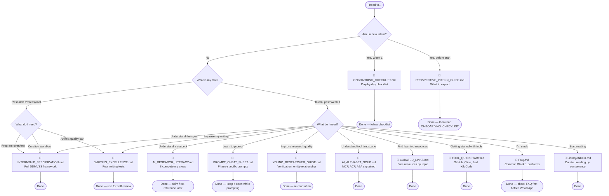

# Document Navigation Map

**Diagram type:** flowchart — a decision tree that routes new interns and research professionals to the right document based on what they need to do. Designed as a "how-to" reference to replace blind skimming with targeted reading.

Use this diagram when you are unsure which document to open. Start at the top and follow the branches matching your situation. Each terminal node links to the specific document. For the full document listing, see [`Internship/README.md`](../../Internship/README.md).

**Cross-references:**
- [`Internship/README.md`](../../Internship/README.md) — Complete document listing with audience and purpose
- [`PROSPECTIVE_INTERN_GUIDE.md`](../../Internship/PROSPECTIVE_INTERN_GUIDE.md) — Start here if you are considering the internship
- [`ONBOARDING_CHECKLIST.md`](../../Internship/ONBOARDING_CHECKLIST.md) — Week 1 day-by-day walkthrough
