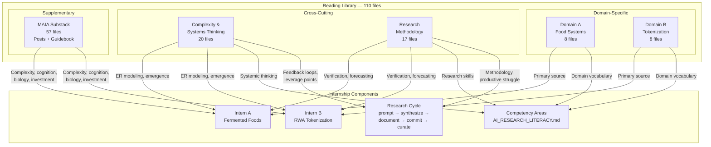

# Library Structure

**Diagram type:** flowchart — shows the simplified reading library's five folders, their file counts, key resources, and how they map to internship domains and competency areas. Serves as the reference architecture for the library.

The library was simplified to five core folders. Each folder maps to specific research needs in the 8-week program. Use this diagram to understand which folder to browse for your current research phase. For detailed relevance descriptions per file, see [`Library/INDEX.md`](../../Internship/Library/INDEX.md).

**Cross-references:**
- [`Library/INDEX.md`](../../Internship/Library/INDEX.md) — Full file listing with relevance annotations
- [`flowchart-program-architecture.md`](flowchart-program-architecture.md) — How the library fits into the overall program
- [`AI_RESEARCH_LITERACY.md`](../../Internship/AI_RESEARCH_LITERACY.md) — The 8 competency areas each folder supports
