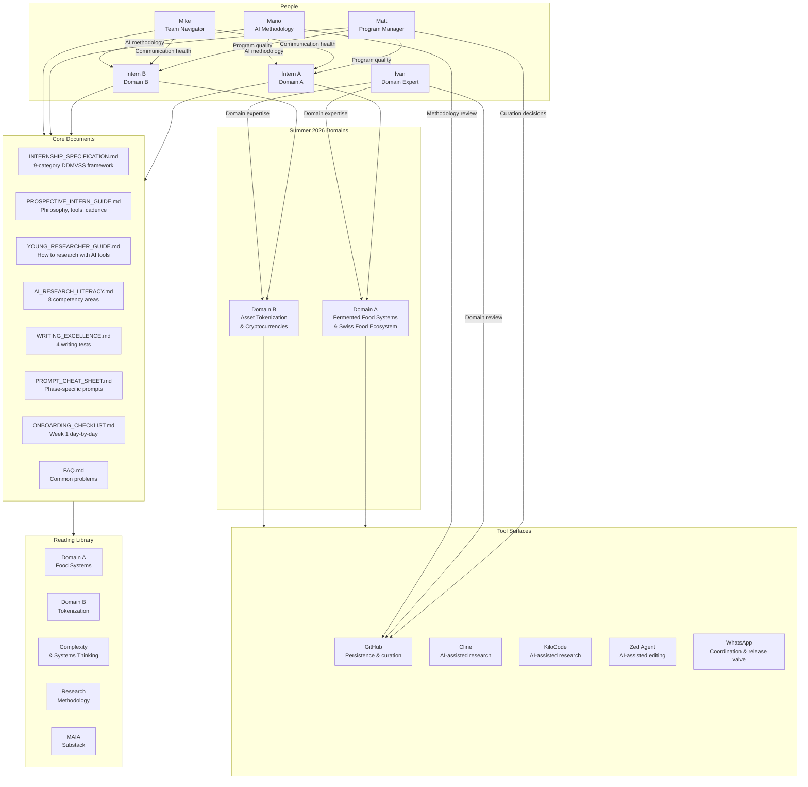

# Program Architecture

**Diagram type:** flowchart — shows how the internship program's structural components (interns, research professionals, domains, documents, and tool surfaces) fit together as a system. Serves as the reference architecture diagram for the entire program.

This diagram is the "map of the territory" — use it when you need to understand how a specific document, role, or tool relates to the larger program structure. For step-by-step navigation, see [`flowchart-document-navigation.md`](flowchart-document-navigation.md). For the 8-week timeline, see [`INTERNSHIP_SPECIFICATION.md`](../../Internship/INTERNSHIP_SPECIFICATION.md) §8.

**Cross-references:**
- [`INTERNSHIP_SPECIFICATION.md`](../../Internship/INTERNSHIP_SPECIFICATION.md) — Full program specification with all 11 categories
- [`Internship/README.md`](../../Internship/README.md) — Program portal with document index
- [`flowchart-document-navigation.md`](flowchart-document-navigation.md) — Which document to read and when
