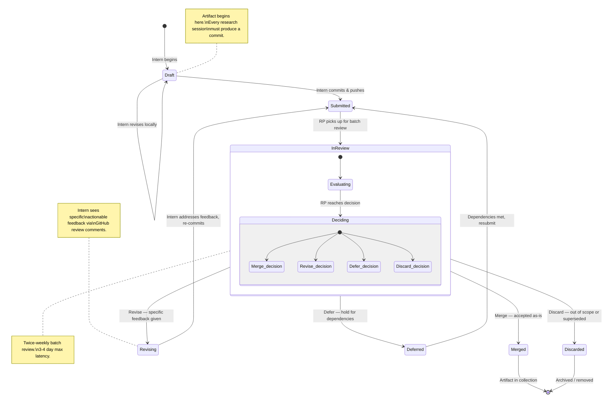

# Artifact Curation Lifecycle

**Diagram type:** state — traces every artifact through the curation pipeline from creation to final disposition. This is the state machine that governs all intern-produced artifacts in the program.

Each artifact moves through exactly this lifecycle. The curation decisions (Merge, Revise, Defer, Discard) are made by research professionals during twice-weekly batch reviews. Interns continue producing new artifacts during the 3-4 day gap between reviews. For the full curation policy, see [`INTERNSHIP_SPECIFICATION.md`](../../Internship/INTERNSHIP_SPECIFICATION.md) §9.

**Cross-references:**
- [`INTERNSHIP_SPECIFICATION.md`](../../Internship/INTERNSHIP_SPECIFICATION.md) §9 — Curation decision gradient and cadence
- [`PROSPECTIVE_INTERN_GUIDE.md`](../../Internship/PROSPECTIVE_INTERN_GUIDE.md) §"The Cadence" — How curation fits into weekly rhythm
- [`ONBOARDING_CHECKLIST.md`](../../Internship/ONBOARDING_CHECKLIST.md) — First curation review happens Week 2
