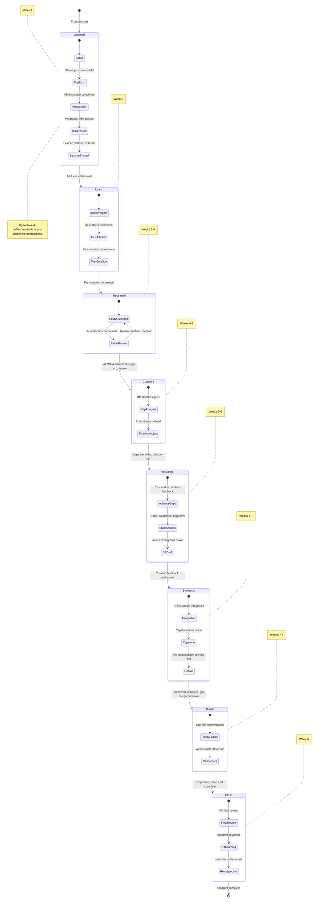

# Program Phase Transitions

**Diagram type:** state — shows the 8-week internship program as a state machine, with each phase's entry and exit criteria made explicit. Designed for the reference reader — someone consulting the program structure who needs to know what qualifies as completing each phase.

Each phase has a clear exit criterion (from [`INTERNSHIP_SPECIFICATION.md`](../../Internship/INTERNSHIP_SPECIFICATION.md) §8.2). Transitions are gated by these criteria, not by calendar date alone. The buffer phase is available at any point for interruptions. Compare with the Gantt timeline in the specification for the calendar view.

**Cross-references:**
- [`INTERNSHIP_SPECIFICATION.md`](../../Internship/INTERNSHIP_SPECIFICATION.md) §8 — Full phase map with Gantt timeline
- [`PROSPECTIVE_INTERN_GUIDE.md`](../../Internship/PROSPECTIVE_INTERN_GUIDE.md) §"The Cadence" — Narrative walkthrough of each phase
- [`ONBOARDING_CHECKLIST.md`](../../Internship/ONBOARDING_CHECKLIST.md) — Detailed Week 1 checklist
